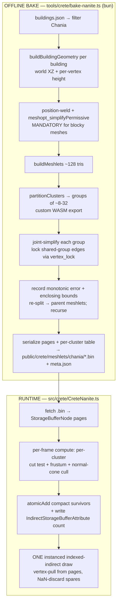

# Nanite Cadastre — v0 Design Spec (Chania-first)

> Date: 2026-06-20 · Branch: `gavdos` · Engine: `3d/fable5-world-demo` (three.js r184 WebGPU/TSL)
> Status: **DESIGN — awaiting Denis's review before any code.**
> Feasibility: **GREEN.** Both crux risks resolved (see §4). Grounded in a cited research pass (see §13).

---

## 1. Problem & Goal

The Hellenic Cadastre structures (buildings, walls, roads) must be **always on** — visible at every camera
distance, from the whole-Crete view (~280 km) down to street level — with **zero frame hitches** and an
**instant load every time**.

Today's cadastre cannot do this:
- `CreteBuildings` merges 34,996 footprints into 6 town meshes, `CreteRoads` merges 9,700 segments into one,
  `GavdosStructures` batches buildings — each is a **blocking CPU build + one big upload** (the hitch), then
  added straight to the scene with **no LOD**, just distance-culled to invisible (buildings 18 km).
- "Always on" is impossible with distance-culling (you'd draw 34,996 full-detail buildings at all times), and
  the engine's "nanite-like" scatter is actually **discrete-ring instancing**, not continuous cluster LOD — it
  cannot absorb a single high-res mesh.

**The goal:** a real **Nanite-style continuous cluster-LOD** renderer for the cadastre, baked to disk so the
runtime never rebuilds it. Far away → the whole town collapses to a handful of clusters (cheap). Up close →
full detail. No popping, no culling-to-invisible, no per-load rebuild.

**v0 scope = the town of Chania, buildings only.** Prove the hard part (the DAG + the GPU cut) end-to-end on
one town, then scale.

## 2. Verdict & Scope

| | |
|---|---|
| **In scope (v0)** | Chania buildings (~5,630 / ~134k tris). Offline bake → `.bin` DAG. Runtime load + per-frame GPU LOD-cut + frustum/normal-cone cull + single hardware indirect draw. Always-on (no distance-cull). |
| **Out of scope (v0)** | Roads, walls, Gavdos structures, other 5 towns; software rasterizer; two-pass HZB occlusion; on-demand page streaming; impostors; satellite-albedo bake. All deferred — see §11. |

## 3. Architecture Overview

Two halves: an **offline bake** (run once, by us / a build step) and a **runtime** (every session, GPU-driven).

**Why this satisfies all three goals:**
- **Always-on:** the cut re-projects every frame; far view → cut sits near the DAG root → a few clusters.
- **Zero hitch:** the DAG is built *offline*; runtime only loads pre-built pages (chunked/async like other
  `.bin` loads). No runtime DAG build, no blocking merge.
- **Instant load (every time, not just second):** we ship the `.bin`; the expensive work already happened.

## 4. The Two Crux Risks — Resolved

### 4.1 meshoptimizer JS lacks `partitionClusters` → ship a tiny custom WASM
`meshoptimizer@1.1.1` (latest) exposes `buildMeshlets`, `simplify`, `simplifyWithAttributes` (with the
`LockBorder`/`Sparse`/`Permissive` flags **and** a `vertex_lock: Uint8Array` mask) — verified present in the
typings, JS, and embedded WASM. The **only** gap is `meshopt_partitionClusters` (the meshlet-grouping step
that defines DAG quality): verified absent from JS *and* the embedded WASM (`grep partition` = 0 hits;
export tables dumped).

**Resolution (chosen):** compile a ~50–100 KB WASM from zeux/meshoptimizer's MIT C source that additionally
exports `meshopt_partitionClusters` (the repo's own `js/` build script already produces the shipped blobs —
add one symbol to `-sEXPORTED_FUNCTIONS`). Load it from the bun bake tool alongside the npm package, which
handles everything else. Bake is offline, so a one-time native/wasm dependency is acceptable and keeps us on
the battle-tested algorithm. (Pure-JS graph-partition fallback exists but risks DAG quality — not chosen.)

### 4.2 three r184 can't rebuild an index buffer on GPU → use a single instanced indirect draw
three r184 **already** does GPU-driven **indexed-indirect hardware** drawing (`WebGPUBackend.drawIndexedIndirect`;
`IndirectStorageBufferAttribute`; vegetation kernels write `instanceCount` GPU-side every frame). What it does
**not** support: building/selecting an index buffer inside a compute kernel, or a GPU-decided draw *count*
(no `multiDrawIndirect`).

**Resolution (chosen, v0):** the Bevy hardware-raster pattern — **one** indexed-indirect draw, `instanceCount`
= survivor-cluster count (GPU-written via `atomicAdd`), each instance = one selected cluster, `indexCount` =
`MAX_TRIS*3` fixed. The vertex shader reads `clusterId = survivors[instanceIndex]`, pulls the triangle's
vertices from the meshlet pages in storage buffers, and emits NaN for unused triangles (degenerate → discarded).
No software rasterizer, no missing-feature dependency. Reuses the exact `setIndirect` + indirect-count plumbing
the vegetation system already ships.

## 5. Bake Pipeline — `tools/crete/bake-nanite.ts`

Mirrors the existing `tools/crete/bake-satellite-tiles.ts` bake-to-disk pattern.

1. **Load + filter:** read `public/crete/buildings.json`; select Chania's bucket (reuse `nearestTown`,
   `CreteBuildings.ts:141-156`). ~5,630 buildings.
2. **Build geometry:** reuse `buildBuildingGeometry` (`CreteBuildings.ts:86-139`) → per-building
   `BufferGeometry` in fable5 world XZ, per-vertex Y from `hf.heightAtCpu` (`Heightfield.ts:237`). *(Bake tool
   computes coordinates from data via `lonLatToWorld` — no hardcoded town centers.)*
3. **Concatenate + weld:** merge all Chania building triangles into one position stream; **position-only weld**
   duplicate vertices (attributes rebuilt after). *Mandatory* — faceted geometry otherwise refuses to collapse.
4. **LOD0 meshlets:** `meshopt_buildMeshlets` (maxVerts ≤256, maxTris ≈128, coneWeight for normal cones).
5. **DAG levels (recurse until 1 root):**
   - `meshopt_partitionClusters` (custom WASM) → groups of ~8–32 adjacent meshlets.
   - For each group: gather triangles, build a `vertex_lock` mask marking vertices on edges **shared with other
     groups** (lock those; leave outward edges free), `simplifyWithAttributes(..., vertex_lock, ['ErrorAbsolute','Permissive'])`
     to ~½ triangles. **Do NOT use `LockBorder`** (locks whole silhouette → tanks quality).
   - Record **monotonic** absolute error (`parentError = max(childErrors) + thisLevelError`) and an **enclosing**
     bounding sphere (parent encloses all children). Inflate spheres so a child's nearest-camera point is never
     nearer than its parent's (crack-fix).
   - `buildMeshlets` on the simplified group → parent meshlets; link child→parent.
6. **Serialize** (see §6).

**Validation in the tool:** assert error & spheres monotonic up the DAG; assert every meshlet in a group shares
identical error+sphere (else runtime cracks). Fail the bake loudly if violated.

## 6. On-Disk Format — `public/crete/meshlets/chania/`

- `vertices.bin` — interleaved position (+normal, +vdata later) pages.
- `indices.bin` — per-meshlet local index triples (`Uint8`/`Uint16`).
- `clusters.bin` — per-cluster record: `{ center:vec3, radius:f32, error:f32, parentCenter:vec3, parentRadius:f32,
  parentError:f32, vtxOffset:u32, idxOffset:u32, triCount:u32 }`. LOD0 `error=0`; root `parentError=+inf`.
- `meta.json` — counts, page offsets, world bbox, MAX_TRIS, format version (mirrors `public/crete/meta.json`).

## 7. Runtime — `src/crete/CreteNanite.ts`

- **Load:** `fetch()` the `.bin` files (pattern from `GavdosData.ts:244-260`); upload into `StorageBufferNode`s
  via `instancedArray` + `storage` (pattern from `Forests.ts:330`). Chunk uploads across a few frames if needed.
- **Cut-selection compute kernel** (`Fn(...).compute(clusterCount)`, one thread/cluster, no tree walk):
  - **LOD test** (Bevy `lod_error_is_imperceptible`, verbatim lineage):
    `accept = projErr(center,radius,error) ≤ 1px AND projErr(parentCenter,parentRadius,parentError) > 1px`,
    where `projErr = error / max(dist−radius, znear) * (proj[1][1]*0.5) * viewportH`.
  - **Frustum cull:** sphere vs 6 planes (reuse `Forests.ts:686` `inFrustum`).
  - **Normal-cone backface cull:** meshoptimizer singularity-free form (`dot+compare`).
  - **Compact:** `atomicAdd(counter,1)` → write `clusterId` into `survivors[]`; the same count feeds
    `IndirectStorageBufferAttribute` word 1 (`instanceCount`).
- **Draw:** one indexed-indirect instanced draw (`geometry.setIndirect`, `Forests.ts:663-665`). Vertex node:
  `clusterId = survivors[instanceIndex]`; `localTri = vertexIndex/3`; if `localTri ≥ cluster.triCount` → NaN;
  else pull vertex from pages, transform to world, ground to terrain. Material: cadastre cream
  `MeshStandardNodeMaterial` matching today's buildings.
- **Always-on:** registered as a permanent layer; **no `SHOW_DIST` cull** — the DAG cut is the only LOD control.

## 8. Integration Seams (verified file:line)

| Concern | Seam |
|---|---|
| Intercept Chania geometry | before `mergeGeometries`, `CreteBuildings.ts:235` (feed per-building geos to bake instead of merging) |
| Reuse extrusion | `buildBuildingGeometry`, `CreteBuildings.ts:86-139` |
| Coordinates / height | `lonLatToWorld` `CreteConst.ts:88`; `heightAtCpu` `Heightfield.ts:237` |
| Storage buffers + compute | `Forests.ts:330` (`instancedArray`/`storage`), `Scatter.ts:376-488` (`Fn().compute`, `atomicAdd`) |
| Indirect draw | `IndirectStorageBufferAttribute` + `geometry.setIndirect`, `Forests.ts:663-667`, `886-897` |
| Frame loop compute/render | `Engine.ts:149-155` |
| Bake-to-disk pattern | `tools/crete/bake-satellite-tiles.ts:13-49`, load `GavdosData.ts:244-260` |
| New files | `tools/crete/bake-nanite.ts`, `tools/crete/meshopt-partition.wasm`, `src/crete/CreteNanite.ts` |

## 9. Success Criteria (how we'll verify v0)

1. **Builds & boots:** `tsc` clean; `?scene=crete` boots with `CreteNanite` active; zero console errors.
2. **Zero hitch:** no frame spike when Chania appears (vs the current `mergeGeometries` stall) — timestamp-query
   the cull+draw, and confirm load is async.
3. **Crack-free continuous LOD:** fly from 280 km → street level; no holes, no T-junction seams, no visible
   pops at cut transitions.
4. **Always-on:** Chania buildings visible at *every* distance (collapsed when far, full when near) — never
   vanish.
5. **Perf:** Chania cut + draw stays within frame budget at the GAVDOS-DELTA bookmark FPS gate (≥24 @1080p),
   ideally far cheaper than today's full-detail merged mesh.
6. **Visual parity:** up-close buildings match today's extruded look (footprint, height, material).
7. **Denis is the visual judge** (per house rule): server stays live, I do non-visual checks, Denis confirms
   look/feel.

## 10. Data Flow & Coordinates

All geometry in fable5 world XZ (meters from `CRETE_CENTER`), per-vertex Y grounded via bilinear `heightAtCpu`.
Known v0 limitation (accepted): height sampled at footprint **centroid** only → flat base per building (matches
today). Bake stores world-space positions; runtime applies camera-relative projection in the cut test.

## 11. Staging Beyond v0

- **v1 — scale + polish:** all 6 towns + roads + walls + Gavdos structures; GPU index-compaction into a single
  shared buffer (research option B) if per-cluster instanced draws bottleneck; two-pass HZB occlusion culling;
  per-vertex terrain grounding for large footprints.
- **v2 — extreme density:** compute software rasterizer + 32-bit visibility buffer (WebGPU has no `atomic<u64>`;
  pack depth+payload) for sub-pixel triangles; on-demand page streaming for memory; impostors for the far field.

## 12. Risks & Open Questions

- **Custom WASM build step** adds a one-time toolchain dependency (emscripten/clang). Mitigation: vendor the
  prebuilt `.wasm`; document the rebuild. *(Open: confirm emscripten is available on this machine, else use a
  native CLI / gltfpack shell-out.)*
- **DAG quality on tiny/disjoint building parts** — `partitionClusters` v1.1 handles disconnected clusters;
  validate on Chania's sparser footprints.
- **Single-draw throughput** — v0 issues **one** instanced draw (one instance per surviving cluster, fixed
  `MAX_TRIS*3` verts each), so spare triangles in partly-filled clusters waste primitive-assembler throughput
  (Bevy's noted cost of this exact path). Acceptable for Chania; if the visible cut gets very large up close,
  revisit option B (GPU-compacted single index buffer) or the software rasterizer in v1/v2.
- **Coordinate sanity** — research surfaced a minor centroid/bbox inconsistency; the bake tool derives all coords
  from `lonLatToWorld` at build time (no hardcoded centers), so this is a validation check, not a design risk.

## 13. References (verified in research pass `wf_b076a809`)

- Karis, *A Deep Dive into Nanite Virtualized Geometry*, SIGGRAPH 2021.
- jglrxavpok, *Recreating Nanite* series (LOD gen, runtime LOD select).
- zeux/meshoptimizer: `demo/nanite.cpp`, `demo/clusterlod.h`, discussions #750/#783; `meshopt_partitionClusters`
  stable since v0.25.
- Bevy virtual geometry (JMS55) 0.14–0.16 writeups — `lod_error_is_imperceptible` WGSL, monotonic error.
- `Scthe/nanite-webgpu` — closest WebGPU/TS structural template.
- Engine facts: see memory `knowledge_fable5_scatter_not_nanite` and the cited `file:line` seams in §8.
