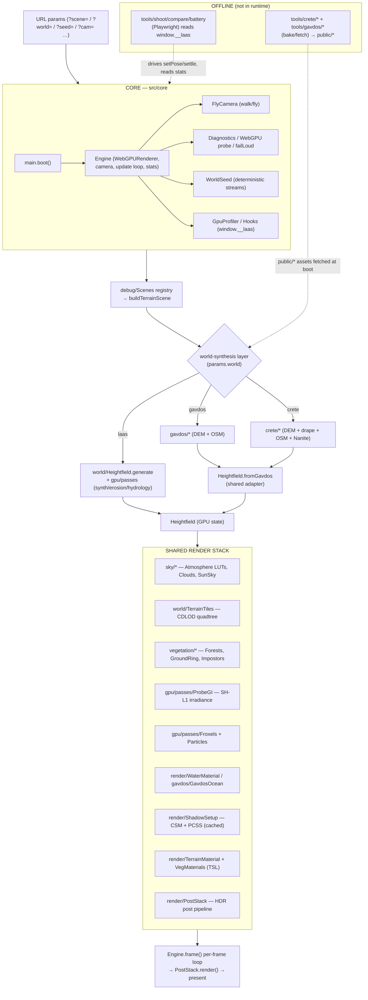
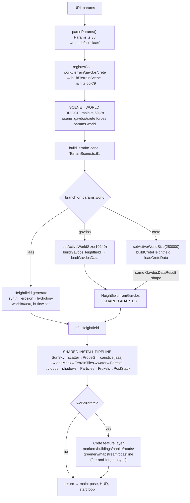
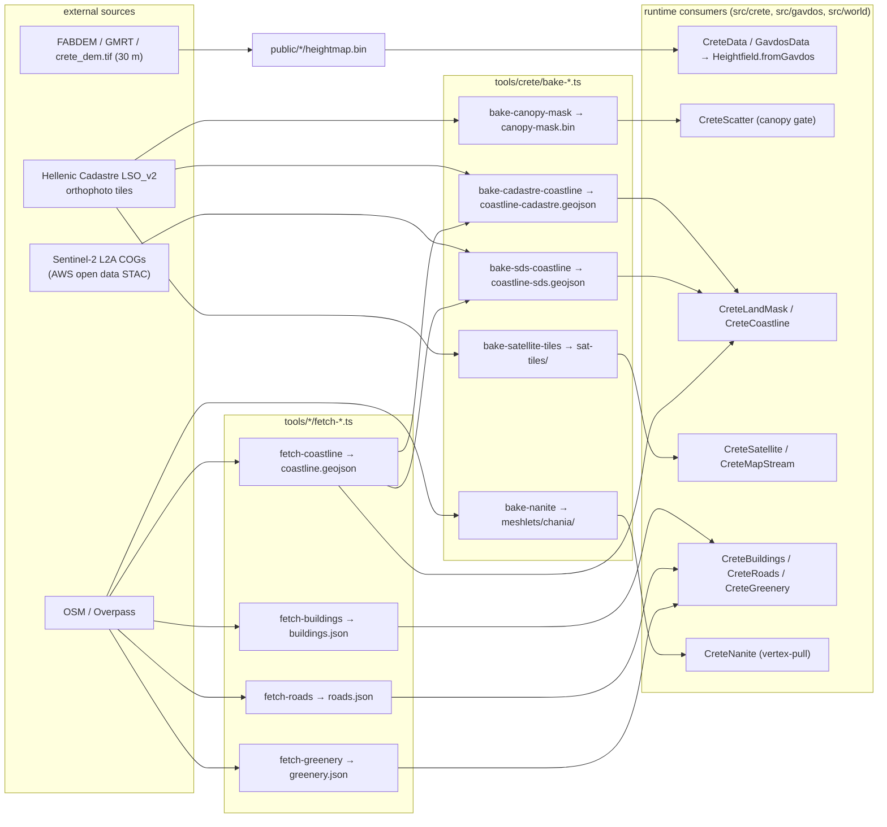

# fable5-world-demo — Engine Architecture Reference

> Canonical engineering reference for the `laas` package (`fable5-world-demo`): a single
> WebGPU/TSL Three.js (r0.184, pinned) photoreal world engine. Synthesized from per-subsystem
> architecture maps and cross-cutting flow traces. Cite `file:line` when reading the source.

---

## 1. Overview

`fable5-world-demo` is **one** WebGPU-only rendering engine (Three.js `0.184.0`, `three/webgpu` +
`three/tsl`, no WebGL fallback by design) that renders **three different worlds** behind a single
`params.world` enum. The engine began life as **PROJECT LAAS** — a capability stress-test of
Anthropic's "Claude Fable 5" model: build a fully procedural, UE5-showcase-fidelity 4×4 km open
world in the browser, ~99% authored by the model from one human brief (`PROJECT_LAAS_v2.md`),
deterministic from `?seed=N`, strict TypeScript with zero `any`, and zero external assets. That
same engine has since been **forked-in-place** to render two additional, real-data worlds: a 1:1
cadastral reconstruction of the island of **Gavdos** (`?scene=gavdos`, FABDEM DEM + OSM vectors)
and a whole-island **Crete** photoreal map explorer (`?scene=crete`, real 30 m DEM + a streamed
satellite/cadastre drape + 35k OSM buildings + 418 beach markers).

The architectural thesis is **swap the world-synthesis layer, keep the render stack**. Terrain
sampling, CDLOD tiling, the Hillaire/Bruneton LUT atmosphere, volumetric clouds, irradiance-probe
GI, GPU-driven vegetation (cull → LOD → impostor), cached 4-cascade CSM + PCSS, froxel volumetrics,
caustics, water, and the full HDR post stack are **shared and byte-identical** across all three
worlds. Only the data source (procedural synthesis vs. real DEM), geodesy, coastline, scatter, and
ocean change — and they change at the **data level**, not the engine level: Gavdos and Crete both
emit the same `GavdosDataResult` shape into the same `Heightfield.fromGavdos` adapter, so almost no
downstream code branches.

| World | URL | Source | World size | Heightfield path |
|-------|-----|--------|-----------|------------------|
| **laas** (default) | `/` | Fully procedural, GPU-synthesized, deterministic from `?seed` | 4096 m | `Heightfield.generate` |
| **gavdos** | `?scene=gavdos` | FABDEM 30 m DEM + OSM (Hellenic Cadastre region) | 10240 m | `buildGavdosHeightfield` → `Heightfield.fromGavdos` |
| **crete** | `?scene=crete` | Real 30 m DEM (peak 2434 m) + streamed satellite/cadastre drape + OSM | 280000 m | `buildCreteHeightfield` → `Heightfield.fromGavdos` |

Verified facts: Three.js `0.184.0`, `@types/three ^0.184.1`, TypeScript `^5.7.0`, Vite `^6.0.0`,
`meshoptimizer 1.1.1`, `geotiff ^3.0.5`, `proj4 ^2.20.9`, `sharp ^0.34.0`, `playwright ^1.50.0`,
`tsx ^4.19.0` (from `package.json`). Source tree is ~28,000 lines of strict TS across 97 files.

---

## 2. Quickstart

**All tooling is bun/bunx + tsx. Never npm/npx.**

### Run the dev server

```bash
bun run dev          # vite --port 5173 --strictPort  → http://localhost:5173
```

Then open one of:

| World | URL |
|-------|-----|
| LAAS (procedural default) | `http://localhost:5173/` |
| Gavdos (real island) | `http://localhost:5173/?scene=gavdos` |
| Crete (photoreal map) | `http://localhost:5173/?scene=crete` |

> WebGPU only — **Chrome/Chromium 113+**. Safari/Firefox/mobile are detected and refused at the
> `browserGate()` (bypass with `?nogate=1` at your own risk). If WebGPU is unavailable the engine
> **fail-louds** with a `chrome://gpu` checklist and stops — there is no WebGL fallback.

### Build / typecheck

```bash
bun run build        # tsc --noEmit && vite build   (build base is /laas/, dev base is /)
bun run typecheck    # tsc --noEmit                  (strict, zero `any`)
```

### Headless verification (Playwright + WebGPU)

```bash
bun run shoot        # tsx tools/shoot.ts   — headless WebGPU screenshots
bun run compare      # tsx tools/compare.ts — diff against reference frames
bun run battery      # tsx tools/battery.ts — multi-bookmark shot battery
```

> `tools/shoot.ts` has **no world passthrough** — it relies on the scene→world bridge
> (`main.ts:69-78`), so `?scene=gavdos` / `?scene=crete` alone boot the real world.

### Offline bake / fetch tools (`tools/crete/*`, `tools/gavdos/*`)

These are **long-running, human-invoked** Node/bun scripts (NOT CI). They never import the engine.
They turn external geodata into static pre-baked assets under `public/crete/` and `public/gavdos/`.

```bash
# Crete — OSM fetch lane (lightweight, via Overpass)
bun tools/crete/fetch-coastline.ts     # → public/crete/coastline.geojson  (INPUT to coastline bakes)
bun tools/crete/fetch-buildings.ts     # → public/crete/buildings.json
bun tools/crete/fetch-roads.ts         # → public/crete/roads.json
bun tools/crete/fetch-greenery.ts      # → public/crete/greenery.json

# Crete — bake lane (heavy, imagery/geometry)
bun tools/crete/bake-canopy-mask.ts        # → canopy-mask.bin (ExG vegetation mask from LSO_v2 z13)
bun tools/crete/bake-cadastre-coastline.ts # → coastline-cadastre.geojson (snap OSM to LSO_v2 waterline)
bun tools/crete/bake-sds-coastline.ts      # → coastline-sds.geojson (snap to Sentinel-2 MNDWI)
bun tools/crete/bake-satellite-tiles.ts    # → sat-tiles/<z>/<x>/<y>.jpg (z12 drape, offline first load)
bun tools/crete/bake-nanite.ts --prep      # T1: extrude OSM → .cache/chania-prep.bin
bun tools/crete/bake-nanite.ts             # T2: cluster DAG → meshlets/chania/{vertices,indices,clusters}.bin

# Gavdos
bun tools/gavdos/build-data.ts all     # copy binaries from sibling repo + Overpass vectors + roadmask
bun tools/gavdos/fetch-coastline.ts    # → public/gavdos/coastline.geojson
bun tools/gavdos/verify-world.ts       # full PASS/FAIL render battery
```

---

## 3. Repository map

### Top-level directories & key files

| Path | Role |
|------|------|
| `index.html` | Single page: `#app` canvas container + `#boot` overlay; loads `/src/main.ts`. |
| `src/` | All engine + world source (TypeScript strict, ~28k lines, 97 files). |
| `tools/` | Headless verification harness + offline bake/fetch pipeline (~7.3k lines). |
| `public/crete/` | Pre-baked Crete assets: `heightmap.bin`, coastlines, `canopy-mask.bin`, `sat-tiles/`, `meshlets/`, `*.json`. |
| `public/gavdos/` | Pre-baked Gavdos assets: `heightmap.bin`, `mask.bin`, `species.bin`, `weights.bin`, `roadmask.png`, `vectors.json`, etc. |
| `docs/` | `DELTA.md`, `DEVIATIONS.md`, `THREE-NOTES.md` (the verified r0.184 API contract). |
| `reference/`, `shots/` | UE5/Witcher reference frames and rendered screenshots for the reference-delta loop. |
| `vite.config.ts` | Vite config: esnext, port 5173 strictPort, usePolling watch, base `/laas/` on build else `/`. |
| `PROJECT_LAAS_v2.md` | THE BRIEF — the only human-authored spec (six pillars, hard floors, 8-phase plan). |
| `STATUS.md` | Model's durable cross-session working memory (mission, env facts, phase checklist). |
| `README.md` | Public Fable-5 narrative + how to run. |
| `GAVDOS.md`, `GAVDOS-DELTA.md` | Gavdos branch working memory + final 7-gate QA report (3 PASS / 4 FAIL). |
| `CRETE-ON-GAVDOS-PLAN.md` | Crete world plan + dated progress log. |
| `NANITE-CADASTRE-V0-SPEC.md` | Design-only spec for a real Nanite cluster-LOD renderer (no code yet). |

### `src/` subdirectories

| Subdir | Files | Lines | Role |
|--------|------:|------:|------|
| `src/core/` | 10 | 1487 | Boot orchestration, Engine shell, FlyCamera, diagnostics, seeding, hooks, GPU profiler. |
| `src/world/` | 7 | 2005 | Terrain backbone: Heightfield (GPU state owner), CDLOD TerrainTiles, MacroMap, water clipmap, canopy shell, shadow proxy, world constants. |
| `src/gpu/` | 14 | 3463 | Boot + per-frame compute kernels: synthesis/erosion/hydrology/biome/noise/bark bakes, scatter, ProbeGI, Froxels, Particles, shared TSL noise. |
| `src/render/` | 15 | 4124 | TSL node materials (terrain/water/veg/rock/impostor), GPU instancing, shadows (CSM+PCSS), HDR post stack, GTAO, caustics, wind, color grade. |
| `src/sky/` | 3 | 913 | Hillaire LUT atmosphere, 2-layer volumetric clouds, time-of-day SunSky façade. |
| `src/vegetation/` | 16 | 6287 | GPU-driven forest renderer, scatter pools, grass/groundcover carpets, impostors, procedural tree/skeleton builders, species params. |
| `src/gavdos/` | 8 | 2797 | Gavdos world-synthesis layer: geodesy, data loader, Mediterranean ocean, veg library, OSM structures, coastline conditioning. |
| `src/crete/` | 14 | 4401 | Crete world-synthesis layer: geodesy, data loader, streamed drape, scatter, greenery, buildings, roads, Nanite, beach markers, coastlines, land mask. |
| `src/debug/` | 9 | 2396 | Scene router + the single big `buildTerrainScene` builder, diagnostic scenes (sanity/gallery/shadowtest), DOM UI (view buttons, bookmarks, HUD, scatter debug). |
| `src/main.ts` | 1 | 125 | The `boot()` entry point. |

---

## 4. System architecture

The engine is a layered stack. The **core** owns the renderer and the registration-ordered update
loop. The **world-synthesis layer** (one of laas/gavdos/crete) produces a `Heightfield`. The
**shared render stack** consumes that heightfield to draw terrain, sky, vegetation, water, shadows,
and post. A thin **debug/UI** layer routes URLs to scenes and exposes the `window.__laas` tooling
surface. Offline **bake tools** sit entirely outside the runtime.



The major layers and how they connect:

- **Core / boot** (`src/core`): `main.boot()` runs a strict, fail-loud boot sequence and constructs
  the `Engine`, which owns the single `WebGPURenderer`, the `PerspectiveCamera`, and a
  registration-ordered per-frame update loop. Every other subsystem registers per-frame work via
  `engine.onUpdate()` and talks to tooling through the global `window.__laas` hooks object.
- **World-synthesis layer**: selected by `params.world`. Produces a `Heightfield` — the geometric
  and sampling layer everything else reads from. For real-DEM worlds it is wrapped by the shared
  `Heightfield.fromGavdos` adapter so downstream code does not branch.
- **Shared render stack** (`src/world`, `src/render`, `src/sky`, `src/vegetation`, `src/gpu`):
  terrain tiles + materials, atmosphere + clouds, GPU vegetation, GI probes, shadows, volumetrics,
  water, and the HDR post pipeline. All TSL on `three/webgpu`. Optional features are JS-pruned per
  world so absent paths stay byte-identical.
- **Scene routing / UI** (`src/debug`): a tiny string→builder registry; the single shared builder
  `buildTerrainScene` assembles the whole stack and branches internally on `params.world`. A DOM UI
  layer provides camera presets, bookmarks, a 92 s flythrough, and an F3 diagnostics overlay.
- **Offline tools** (`tools/`): the verification harness reads/writes `window.__laas`; the bake
  pipeline produces the static `public/*` assets the runtime plain-fetches.

---

## 5. Multi-world abstraction

### The seam in one sentence

The engine swaps **only** the world-synthesis layer (data source + geodesy + coastline + scatter +
ocean) behind a single `params.world` enum, while the entire render stack (Heightfield container,
TerrainTiles CDLOD, SunSky atmosphere, ProbeGI, Forests veg, shadows, PostStack) is shared and
byte-identical across worlds. The swap is **data-level not engine-level**: Gavdos and Crete both
emit the same `GavdosDataResult` shape into the same `Heightfield.fromGavdos` adapter, so almost no
downstream code branches.

### World selection (dual-keyed)

`WorldSource = 'laas' | 'gavdos' | 'crete'` is defined at `src/core/Params.ts:5`; `world` defaults
to `'laas'`, `scene` defaults to `'world'`. Both `?world=` and `?scene=` exist independently.

1. `parseParams()` (`Params.ts:38`) reads the URL.
2. `main.ts` registers **every** world scene to the **same** builder:
   `registerScene('world'|'terrain'|'gavdos'|'crete', buildTerrainScene)` (`main.ts:60-79`).
   **The scene name is NOT the world** — they all map to one builder.
3. **Scene→world bridge** (`main.ts:69-78`, sync, runs AFTER `parseParams`):
   `if (params.scene==='gavdos' && params.world!=='gavdos') params.world='gavdos'` and the same for
   `'crete'`. This is why `?scene=gavdos` alone boots the island — single-param tools like
   `tools/shoot.ts` (no world passthrough) rely on it. `?scene=world` keeps whatever `?world=` said.
   **`params.world` is only FINALIZED here, inside boot.**
4. `await buildScene(params.scene, ctx)` (`main.ts:88` → `Scenes.ts:25`) dispatches to
   `buildTerrainScene`.

### The three branches inside `buildTerrainScene`

`buildTerrainScene` (`src/debug/TerrainScene.ts:61`) branches three ways on `params.world`. The
branch is **order-critical** because it must size the world before any system constructs.

| | laas (else) | gavdos | crete |
|---|---|---|---|
| World size | default `WORLD_SIZE=4096` | `setActiveWorldSize(GAVDOS_WORLD_SIZE=10240)` FIRST | `setActiveWorldSize(CRETE_WORLD_SIZE=280000)` FIRST |
| Grid caps | from `qualityConfig` | `heightRes≤2048`, `simRes≤1024` | `heightRes≤2048`, `simRes≤1024` (3072 pushed load to ~40 s) |
| Heightfield | `Heightfield.generate` — full procedural GPU pipeline | `buildGavdosHeightfield` → `loadGavdosData` → `Heightfield.fromGavdos` | `buildCreteHeightfield` → `loadCreteData` → `Heightfield.fromGavdos` |
| Hydrology | `hf.flow` populated | none (`hf.flow===null`) | none (`hf.flow===null`) |
| Spawn | `findWalkSpawn` | 1800 m over origin | `CRETE_WORLD_SIZE*0.18` over origin |
| Per-frame camera | — | — | `updateCreteCamera`: ≥25 m ground clamp + adaptive near/far |

### The shared adapter — `Heightfield.fromGavdos`

`Heightfield.fromGavdos(data, cfg, mp)` (`src/world/Heightfield.ts:148`) is what makes Gavdos AND
Crete look like a procedurally-generated heightfield to every downstream consumer. It wraps
pre-built buffers/textures (height/hardness/waterY/fields/biome/heightTex/normalTex/noise) into the
standard `Heightfield` object with **no synthesis**. Crete-only satellite-drape fields
(`satelliteTex/satWin/satDetailTex/satDetailWin`) are pulled via `data.* ?? null` — they are
**always null for gavdos** because the `GavdosDataResult` interface is *shared* with `CreteData`.
`hf.gavdosVegData = data` carries species/weights for the scatter.

### The ablation set (`?ablate=`)

A comma-list URL flag is the master kill-switch:
`shell, particles, froxels, veg, grass, water, proxy, gi, canopygi, caustics, wind, structures,
clouds, ao, bounce, contact, taa, bloom`.

**Crete's defaults differ from laas even with no flags**: `buildTerrainScene` force-adds
`shell,particles,froxels` to the ablate set (and thins clouds) so the cadastre orthophoto stays
visible between trees. Three things are gated **laas-only** for one root cause (real-DEM worlds skip
the hydrology pass, so `hf.flow===null`): caustics, `WaterSurface` (replaced by `GavdosOcean`), and
procedural inland water. Gavdos/Crete `waterY` is a dry sentinel everywhere; Crete inland lakes come
from `CreteGreenery` flat translucent meshes, not hydrology.

### Gavdos → Crete reuse points

Crete reuses three distinct Gavdos systems wholesale: **`GavdosOcean`** (the Mediterranean ocean
surface, with the land mask non-null for OSM coast-cut), **`buildGavdosVegLibrary`** (the
Mediterranean veg library — juniper/pine/olive + phrygana — so Crete trees look right for a Greek
island, with the same LOD/impostor/shadow pipeline), and the **`GavdosScatterResult` layout**
(`CreteScatter` packs OSM-polygon placement into the exact same buffer shape).

### How a new world plugs in

1. Add the value to `WorldSource` (`Params.ts:5`) and the `parseParams` switch.
2. Add a `<NewWorld>Const.ts` with `NEW_WORLD_SIZE`, center lon/lat, `M_PER_DEG`, `NORTH_SIGN=-1`,
   `lonLatToWorld`/`worldToSourcePx` (mirror `GavdosConst`/`CreteConst` — never duplicate geodesy).
3. Add a `<NewWorld>Data.ts` returning the **same `GavdosDataResult` shape**, and a
   `build<NewWorld>Heightfield` = `loadData` + `Heightfield.fromGavdos` (mirror `CreteWorld.ts`).
4. In `main.ts` add the scene→world bridge line + `registerScene('newworld', buildTerrainScene)`.
5. In `buildTerrainScene` add an `else if (params.world==='newworld')` branch: `setActiveWorldSize`
   FIRST, cap grids, call the builder, set spawn. Optionally reuse `GavdosOcean` /
   `buildGavdosVegLibrary` / the scatter layout exactly as Crete does, with any world-specific
   feature installs gated on the new enum.

**No render-stack changes are needed — that is the whole point of the abstraction.**



---

## 6. Boot & startup sequence

Boot is driven entirely by `boot()` in `src/main.ts:23`, called once at module load with a
`.catch → failLoud`. It runs a strict, mostly-awaited sequence. Everything up to `engine.start()`
happens **before the first rendered frame** — the boot overlay (`#boot`) is the only thing visible.

### The ordered sequence

| # | Step | File | Async? |
|---|------|------|--------|
| 1 | `index.html` loads `/src/main.ts`; module side-effect calls `boot()` | `index.html:72` | — |
| 2 | `initHooks()` creates `window.__laas`; `installGlobalErrorHooks()` routes window errors → `failLoud` | `main.ts:24-25` | sync |
| 3 | `browserGate()` — environment gate, aborts for mobile/non-Chromium/no-WebGPU unless `?nogate=1` | `main.ts:28` | sync |
| 4 | `parseParams()` snapshots URL → `LaasParams` (`scene` default `'world'`, `world` default `'laas'`) | `Params.ts:38` | sync |
| 5 | `new BootUI(hooks)`; `bootUI.set(0.02)`; **`await probeWebGPU()`** — adapter probe, fail-loud if `!ok` | `main.ts:30-45 → Diagnostics.ts:44` | **async** |
| 6 | **`await Engine.create(params, hooks)`** — see below | `Engine.ts:71-133` | **async** |
| 7 | `new FlyCamera` + `engine.onUpdate(fly.update)` — **REGISTERED FIRST** (order load-bearing) | `main.ts:56-57` | sync |
| 8 | `new WorldSeed`; `registerScene(...)`; **scene→world bridge finalizes `params.world`** | `main.ts:59-79` | sync |
| 9 | Build `WorldContext`; **`await buildScene(params.scene, ctx)`** = `buildTerrainScene` | `main.ts:81-88` | **async (the big step)** |
| 10 | Wire `fly.groundProbe`; apply pose (`?cam`→fly, else `hooks.initialPose`, walk unless `?walk=0`) | `main.ts:91-103` | sync |
| 11 | `new Hud(engine, params)`; publish `hooks.setPose/getPose/settle/flyCamEnabled` | `main.ts:105-112` | sync |
| 12 | **`engine.start()`** → `renderer.setAnimationLoop(frame)` — **render loop / first frame** | `main.ts:114 → Engine.ts:146` | sync |
| 13 | **`await engine.settle(6)`** — wait 6 rendered frames for temporal (TRAA) convergence | `main.ts:115` | **async** |
| 14 | `bootUI.hide()` (fade `#boot`); `hooks.ready = true`; `'[laas] ready'` | `main.ts:116-117` | sync |

### `Engine.create` (`src/core/Engine.ts:71`, async)

1. **A SEPARATE adapter query** purely to read `maxSampledTexturesPerShaderStage` (`Engine.ts:80`).
   Default is 16, but the Crete two-layer cadastre drape needs **17** sampled textures in the
   terrain fragment shader (base + detail), so it requests the adapter's reported max (48 on dev
   hardware) via `requiredLimits` (merged with `buildRequiredLimits(diag)` — storage buffers 16,
   1 GiB buffers). **Miss this and the terrain pipeline is invalid → black/loading screen.**
2. `new WebGPURenderer({antialias:false, trackTimestamp:true, requiredLimits})`; **`await
   renderer.init()`**.
3. `device.onuncapturederror` hook (first 8 logged) so WebGPU validation errors aren't silent.
4. `setPixelRatio(params.dpr ?? min(devicePixelRatio, 1.5))`, `setSize`, ACESFilmic tone mapping,
   `shadowMap.enabled`.
5. `appendChild(renderer.domElement)` to `#app` (throws `'#app container missing'` if absent).
6. `new Engine(...)` constructs `PerspectiveCamera(55, aspect, 0.3, 30000)`. **NOTE: `far=30000` is
   hardcoded**; the Crete branch overrides near/far per-frame (`TerrainScene.ts:138-142`) because
   30 km clips the 280 km world.
7. `GpuProfiler` installed only if `'timestamp-query'` is present; `installPositionInvariance` +
   `installMaterialKeyMemo` render patches; window resize handler.

### The slow synchronous data-load freeze (Crete)

`buildScene` is the single heavy step. For **`?scene=crete`**, its world-data load (`loadCreteData`,
`src/crete/CreteData.ts:203`) is the **~19 s boot freeze**. The root cause is **not** the engine or
render stack — it is **un-yielded synchronous CPU loops on the main thread**, inside the single
awaited `buildCreteHeightfield` promise, while the render loop has **not yet started**
(`engine.start()` is step 12, AFTER `buildScene` returns). Nothing repaints during the load, so the
`#boot` bar visually stalls and the page is hard-frozen on the overlay.

The three culprit loops (no `setTimeout`/`Promise` yield between them):

| Loop | File | Cost |
|------|------|------|
| 2048² bicubic height upsample | `CreteData.ts:245-251` | a nested loop over `heightRes²` on the main thread |
| Per-cell biome classification with neighbour reads | `CreteData.ts:331-406` | over `heightRes²` |
| Satellite per-texel sampler fill | `CreteData.ts:475-490` | 4096×4096 ≈ **16.7M iterations** |

Only the `fetch('/crete/heightmap.bin')` (`CreteData.ts:224`) and the `renderer.computeAsync`
uploads actually yield. Per-stage timing is dumped to `console.table` at `CreteData.ts:608-610`.
The **laas** path is comparatively cheaper at boot because its heavy work is **GPU compute**
(`computeAsync`, off-thread) rather than big synchronous JS loops; the **gavdos** path also runs
single-threaded CPU upsample/coast-fill but over a 2048² grid (far smaller absolute cost).

### What is awaited vs synchronous

- **Truly async (yields to event loop, GPU off-thread):** `probeWebGPU`, `renderer.init`, every
  `renderer.computeAsync`, all `fetch()`, `engine.settle`.
- **Synchronous main-thread CPU (blocks the frame, `#boot` bar stalls):** `browserGate`,
  `parseParams`, all the `buildTerrainScene` construction calls, and **especially** the Crete bake's
  un-yielded JS loops above.
- **Fire-and-forget async (NOT awaited):** the Crete `install*` feature layer
  (`buildNaniteChaniaMesh.then`, `installCreteCoastlineOverlay.then`, and the internal fetches in
  `installCreteBuildings/Roads/Greenery/MapStream`). World boot never aborts on a bad Crete
  dataset — it logs and swallows; per-frame cull closures no-op until the build finishes.

### Two load-bearing ordering rules

1. **`FlyCamera.update` MUST be the first `onUpdate` registered** (`main.ts:56-57`) — registration
   order = per-frame run order, and every later subsystem copies camera state in its own update;
   register the mover later and clouds/aerial lag the camera by one frame during motion.
2. **`setActiveWorldSize()` MUST run before any world system constructs** (`TerrainScene.ts:67/95`)
   because `worldSize()`/`worldHalf()` are module-level mutable globals read at construction time
   across ~26 files. Mutating after construction silently desyncs everything.

```mermaid
flowchart TD
    A["index.html loads /src/main.ts (module)"] --> B["boot() — main.ts:23"]
    B --> C["initHooks + installGlobalErrorHooks"]
    C --> D{"browserGate() SYNC\nmobile/non-Chromium/no-gpu?"}
    D -- abort --> Z0["return (notice shown)"]
    D -- ok --> E["parseParams() → LaasParams\n(world NOT final yet)"]
    E --> F["await probeWebGPU() ASYNC"]
    F -- "!ok" --> Z1["failLoud, return (no WebGL fallback)"]
    F -- ok --> G["await Engine.create() ASYNC\n2nd adapter query (17-tex limit),\nnew WebGPURenderer, await init(),\nappend canvas, render patches"]
    G --> H["new FlyCamera + onUpdate(fly.update)\nREGISTERED FIRST (order-critical)"]
    H --> I["registerScene(all → buildTerrainScene)\nscene→world bridge: finalize params.world"]
    I --> J["await buildScene(scene, ctx) = buildTerrainScene"]

    subgraph BUILD ["buildTerrainScene — all on frozen boot overlay"]
        J --> K["WORLD BRANCH FIRST\nsetActiveWorldSize(10240/280000)\ncap grids ≤2048/1024"]
        K --> LSEL{"params.world?"}
        LSEL -- laas --> M1["await Heightfield.generate\n(GPU computeAsync chain)"]
        LSEL -- gavdos --> M2["await buildGavdosHeightfield"]
        LSEL -- crete --> M3["await buildCreteHeightfield → loadCreteData"]
        M3 --> FREEZE["### ~19s BOOT FREEZE ###\nSYNC un-yielded CPU on main thread:\n2048² bicubic upsample (245-251)\nper-cell biome loop (331-406)\n4096² ≈16.7M satellite fill (475-490)\nrender loop NOT started → #boot stalls"]
        M1 --> N["FIXED INSTALL PIPELINE (order load-bearing):"]
        M2 --> N
        FREEZE --> N
        N --> N1["await SunSky.init (LUTs)"]
        N1 --> N2["await scatter + buildCanopyMap"]
        N2 --> N3["await ProbeGI.init"]
        N3 --> N4["caustics(laas) · wind ctx"]
        N4 --> N5["await crete landMask → TerrainTiles + shadowProxy"]
        N5 --> N6["water / GavdosOcean (+crete pebbles)"]
        N6 --> N7["await Forests veg lib + GroundRing + shell"]
        N7 --> N8["await Clouds.init · setupSunShadows\nParticles · Froxels · PostStack(engine.post)"]
        N8 --> N9["publish groundProbe · spawn pose\nfire-and-forget crete UI/feature installs"]
        N9 --> O["ctx.progress(1) — return to main"]
    end

    O --> P["apply pose (cam/initialPose, walk mode)\nnew Hud · publish setPose/getPose/settle"]
    P --> Q["engine.start()\n### RENDER LOOP / FIRST FRAME ###"]
    Q --> R["await engine.settle(6)"]
    R --> S["bootUI.hide() · hooks.ready = true"]
    Q --> LOOP["Engine.frame (per frame):\ndt clamp · worldTime · updateFns in reg order\n(FlyCamera first) · post.render() · stats · timestamps"]
```



---

## 7. Per-frame render loop

The per-frame loop is `Engine.frame()` (`src/core/Engine.ts:150`) driven by
`renderer.setAnimationLoop`. There is **no engine-level render-throttle on unfocus** — the loop runs
unconditionally; only the browser's native `requestAnimationFrame` backgrounding pauses it under
`setAnimationLoop`. The only blur handler is `FlyCamera` clearing its held keys (`FlyCamera.ts:172`).
`?freeze=1` freezes `worldTime` only (`Engine.ts:156`) — it does **not** pause rendering (used for
deterministic screenshots).

### Frame structure

1. **Timing (sync):** `dt = clamp(rawDt, 0, 0.1)` (`Engine.ts:154`); `elapsed += dt`; if
   `!params.freeze` then `worldTime += dt`.
2. **Run all `updateFns` in REGISTRATION ORDER** (`Engine.ts:162`), CPU-timed into
   `cpu.updateMs100`. Order is load-bearing and fixed by `main.ts` + `buildTerrainScene`.
3. **Render** (`Engine.ts:165-170`): if `engine.post` is set (it is — `PostStack`), call
   `post.meter(renderer)` then `post.render()`.
4. **Stats** (`Engine.ts:171-199`): `cpu.updateMs100`, `cpu.submitMs100`, fps EMA (0.95/0.05),
   `frameMsP95` over a 120-frame ring, `drawCalls`/`triangles` from `renderer.info`.
5. **Timestamp resolve EVERY frame** (`Engine.ts:204-224`): `Promise.all([resolveTimestampsAsync(
   RENDER), resolveTimestampsAsync(COMPUTE)])` → `GpuProfiler.collect`, guarded by
   `timestampPending`. (The 2048-query pool only resets its write index on resolve, so it must
   resolve every frame, not on a cadence.)
6. **Settle waiters decremented** (`Engine.ts:176-181`) — resolves tooling's `settle()` N frames
   later (TAA convergence before screenshots).

### The update-fn order (the spine of the frame)

| # | Update fn | Worlds | What it does |
|---|-----------|--------|--------------|
| 2a | `FlyCamera.update` | all | **FIRST** (`main.ts:57`). Integrates motion, ground/water collision, then `camera.updateMatrixWorld()` so matrices are fresh for every following consumer (`FlyCamera.ts:323`). |
| 2b | `updateCreteCamera` | crete | Clamps camera ≥25 m above ground + adaptive near/far (`TerrainScene.ts:123-145`). |
| 2c | `ProbeGI.tick` | all | Time-sliced SH-L1 irradiance: `renderer.compute(gatherK/publishK)` for 3072 probes ray-marching the heightfield. SYNC fire-and-forget. |
| 2d | `CausticsBake.update` | laas only | Every-frame 256² analytic caustics compute (gavdos/crete have `hf.flow===null`). |
| 2e | `TerrainTiles.update` | all | **CPU-only NO-OP unless camera moved past `moveThresh=max(32, worldSize()/8000)`**; rebuilds the CDLOD quadtree, writes per-tile `vec4 (ox,oz,size,lod)`, sets `mesh.count`. |
| 2f | Water `update` | all | `GavdosOcean.update` (gavdos/crete) or `WaterSurface.update` (laas): snaps ~6 clipmap level origins to camera. CPU-only. |
| 2g | Beach-pebble cull | crete | CPU repack of `InstancedMesh` near matrices within 520 m, sets `inst.count`. |
| 2h | `Forests.update` | all | `updateVegViewPos(camera)`, rebuilds main + 4 CSM cascade cull planes (cascade light cameras read **one frame stale** — `lightMargin` slack absorbs it), then SYNC `renderer.compute` cull→LOD→compaction. Counts read back async every 90 frames. |
| 2i | `GroundRing.update` | all (grass) | Toroidal grass/debris ring SYNC compute. |
| 2j | `Clouds.tick` | all | Advances CPU weather clock; re-bakes the 768² top-down shadow map only every ~2.5 s of world time. (The view-ray cloud march runs in post.) |
| 2k | `Particles.update` | laas (crete ablated) | SYNC compute integrating 131,072 particles in a toroidal box. |
| 2l | `Froxels.update` | laas/gavdos (crete ablated) | SYNC scatter + integrate over the 160×90×64 camera-frustum grid. |

Sky/atmosphere LUTs are **not** re-baked per frame — only on a time-of-day change via
`SunSky.setTimeOfDay`. The per-frame sky work is the cloud march + `atmosphere.aerial` inside post.

### `PostStack` — the render

- **`post.meter(renderer)`** (`PostStack.ts:643`): `renderer.compute(exposureKernel)` — GPU
  log-average auto-exposure feedback from the **last** frame's beauty (no readback). Skipped if
  `lockExposure`. Runs before `render` so the grade multiplies by the updated exposure buffer.
- **`post.render()`** (`PostStack.ts:648`): **`syncCamera()` FIRST** — DELIBERATELY here, after
  ALL `updateFns`, so the camera pose uniforms (`uCamPos/uCamWorld/uProj/uProjInv/uView` + prev-frame
  view/proj for TRAA) are final. This is the documented fix for the "clouds/aerial lag the camera"
  bug; `syncCamera` is intentionally **not** an `onUpdate`. Then the `RenderPipeline` graph runs in
  a single submit.

### The post graph (evaluated GPU-side each `post.render`)

| Stage | What | File |
|-------|------|------|
| i | **scene MRT pass** `pass(scene, camera)` — where terrain CDLOD morph/skirts/micro-displacement (`positionNode`), draped tiles, veg hero/impostor instanced indirect draws, water, structures, canopy shell actually rasterize, with CSM/PCSS shadow sampling | `PostStack.ts:116-143` |
| ii | **merged half-res MRT** (`HalfResMrtNode` scale 0.5) — ONE raster producing up to 3 attachments: cloud march (32-step, blue-noise jitter), GTAO (8 samples / 1.6 m), 8-tap SS-bounce | `PostStack.ts:152-237` |
| iii | **aerialNode** — reconstruct world ray from depth; froxel fog (≤~480 m) FIRST, then `atmosphere.aerial` (km Hillaire haze); composite half-res clouds with depth-aware near-solid gate | `PostStack.ts:240-334` |
| iv | **GTAO joint-bilateral upsample** (full-res depth guide; gated fallback to 4-tap avg; faded 700→1800 m) | `PostStack.ts:347-389` |
| v | **SSCS contact shadows** (8-step depth march toward sun, <280 m) | `PostStack.ts:398-439` |
| vi | `withAO = aerial × aoFaded × contact`; optional SS-bounce add | `PostStack.ts:443-460` |
| vii | **TRAA** fed **analytic camera reprojection** (depth→world→prev clip), NOT the velocity MRT (garbage for `positionNode`-displaced geometry) | `PostStack.ts:489-508` |
| viii | bloom add | `PostStack.ts:512-514` |
| ix | × exposure, white balance, shadow/highlight split-tone, saturation, contrast, vignette/grain → `outputNode`; `renderer.toneMapping = AgX` maps HDR→display | `PostStack.ts:577+, :78` |

### Sync vs async, per frame

All per-frame GPU compute (`ProbeGI.tick`, `Caustics`, `Forests`, `GroundRing`, `Particles`,
`Froxels`, periodic cloud-shadow rebake, exposure meter) uses `renderer.compute` —
**fire-and-forget, NOT awaited**; three queues them into the frame's single submit and WebGPU orders
dispatches within the submit. The only awaited async each frame is the telemetry timestamp resolve
and the once-per-90-frames Forests count readback. Heavy `renderer.computeAsync` work (world-gen
LUTs, erosion, scatter, noise bakes) is **boot-only**.

### Preview / unfocus render-throttle

There is no engine logic for it. `setAnimationLoop` runs every rAF; the **browser** pauses rAF for
background tabs. The single blur listener (`FlyCamera.ts:172`) only clears held keys. Per-frame cost
is not uniform: `TerrainTiles.update` is a CPU no-op until the camera moves; `Clouds` re-bakes its
shadow map only every ~2.5 s; CSM cascades re-rasterize on a `[1,2,4,10]`-frame cadence; sky LUTs are
not a per-frame cost at all.

```mermaid
flowchart TD
  A["Engine.start: setAnimationLoop -> frame(timeMs)\n(no focus pause; browser rAF throttles background)"] --> B["frame(): dt = clamp(rawDt,0,0.1)\nworldTime += dt unless ?freeze"]
  B --> C{"run updateFns in REGISTRATION ORDER\n(CPU-timed)"}
  C --> U1["1. FlyCamera.update\nmove + collision + updateMatrixWorld (FIRST)"]
  U1 --> U2["2. (crete) updateCreteCamera"]
  U2 --> U3["3. ProbeGI.tick (3072 probes) SYNC compute"]
  U3 --> U4["4. (laas) CausticsBake.update 256^2"]
  U4 --> U5["5. TerrainTiles.update (CPU)\nNO-OP unless cam moved > moveThresh"]
  U5 --> U6["6. Water update (clipmap snap, CPU)"]
  U6 --> U7["7. (crete) beach-pebble cull (CPU repack)"]
  U7 --> U8["8. Forests.update\ncull->LOD->compaction SYNC compute"]
  U8 --> U9["9. GroundRing.update SYNC compute"]
  U9 --> U10["10. Clouds.tick\nshadow re-bake only every ~2.5s"]
  U10 --> U11["11. (laas) Particles.update SYNC [crete ablated]"]
  U11 --> U12["12. (laas/gavdos) Froxels.update SYNC [crete ablated]"]
  U12 --> M["post.meter(): exposureKernel compute (last frame)"]
  M --> S["post.render(): syncCamera() FIRST\n(after ALL updates -> pose final, fixes cloud lag)"]
  S --> P1["i. scene MRT pass\nterrain + veg + water + structures + CSM/PCSS"]
  P1 --> P2["ii. half-res MRT: clouds + GTAO + SS-bounce"]
  P2 --> P3["iii. aerial: froxel fog then Hillaire haze + clouds"]
  P3 --> P4["iv. GTAO joint-bilateral upsample"]
  P4 --> P5["v. SSCS contact shadows (<280m)"]
  P5 --> P6["vi. withAO = aerial x ao x contact (+bounce)"]
  P6 --> P7["vii. TRAA (analytic reprojection, NOT velocity MRT)"]
  P7 --> P8["viii. bloom"]
  P8 --> P9["ix. x exposure + grade -> AgX = present"]
  P9 --> ST["collectStats + resolveTimestampsAsync(RENDER,COMPUTE) every frame\n+ decrement settle waiters"]
  ST --> B
```



---

## 8. Subsystem deep-dives

### 8.1 Core engine & boot (`src/core`)

**Purpose.** The boot orchestrator and engine shell shared by all three worlds. `main.ts` runs the
fail-loud boot sequence; `Engine` owns the single `WebGPURenderer`, the perspective camera, the
registration-ordered per-frame update loop, frame timing/stats, and GPU-timestamp profiling.
Everything else hooks in through `Engine.onUpdate()` and `window.__laas`.

**Key files.**

| File | Lines | Role |
|------|------:|------|
| `src/main.ts` | 125 | `boot()` — fail-loud boot sequence. |
| `src/core/Engine.ts` | 226 | `Engine` class — renderer, camera, update loop, frame timing, stats, `settle()`, profiler, resize. |
| `src/core/FlyCamera.ts` | 434 | Walk (grounded RPG: gravity/jump/sprint/head-bob, velocity-Verlet jump) + Fly (free flight, scroll speed, soft collision) rig. `V` toggles. Cooldown-aware pointer lock. |
| `src/core/Diagnostics.ts` | 139 | `probeWebGPU()`, `buildRequiredLimits()`, `failLoud()`, `installGlobalErrorHooks()`, `describeDiagnostics()`. |
| `src/core/Params.ts` | 72 | `LaasParams` + `parseParams()` + `parseCamString()`. |
| `src/core/Hooks.ts` | 97 | `LaasHooks` contract on `window.__laas`. |
| `src/core/BrowserGate.ts` | 102 | Pre-boot environment gate (`isMobileDevice`, `isChromiumBrowser`, `browserGate`). |
| `src/core/GpuProfiler.ts` | 162 | Per-pass GPU timing attribution; patches `backend.updateTimeStampUID`. |
| `src/core/Seed.ts` | 128 | Deterministic seeding (FNV-1a, murmur3 fmix, sfc32 PRNG, `WorldSeed` named streams). |
| `src/core/BootUI.ts` | 35 | Boot overlay progress mirror + fade. |
| `src/core/NoiseJS.ts` | 92 | CPU-side deterministic noise for once-built mesh generators (trees/rocks). |

**Key exports / API.**

| Symbol | File | Purpose |
|--------|------|---------|
| `boot()` | `main.ts:23` | The application entry; orchestrates the entire ordered boot sequence. |
| `Engine` | `Engine.ts:20` | The engine shell every subsystem talks to. |
| `Engine.create(params,hooks)` | `Engine.ts:71` | Async constructor: queries adapter for `maxSampledTexturesPerShaderStage`, builds `WebGPURenderer` with `requiredLimits`, installs patches + profiler. |
| `Engine.onUpdate(fn)` | `Engine.ts:135` | Universal per-frame hook. Update fns run in **registration order** — order is load-bearing. |
| `Engine.settle(frames=8)` | `Engine.ts:140` | Resolves after N rendered frames; lets temporal effects converge before screenshots. |
| `FlyCamera` | `FlyCamera.ts:57` | Interactive camera rig (walk+fly). `setPose` forces fly semantics. |
| `parseParams` / `parseCamString` | `Params.ts:38, :64` | URL→config; `?cam=` pose string decode. |
| `probeWebGPU` | `Diagnostics.ts:44` | Capability probe before renderer creation; source of `hooks.diag`. |
| `buildRequiredLimits(d)` | `Diagnostics.ts:29` | WebGPU device `requiredLimits` (storage buffers/textures, 1 GiB buffers), clamped to adapter maxima. |
| `failLoud(title, details)` | `Diagnostics.ts:93` | Full-screen fatal overlay + `window.__laas.error`. No-silent-failures primitive. |
| `WorldSeed` | `Seed.ts:112` | Root deterministic seed container; subsystems pull decorrelated streams by string key. |
| `initHooks()` | `Hooks.ts:78` | Creates `window.__laas` — the contract with the Playwright harness. |

**Internal flow.** `boot()` runs strictly ordered (see §6). `Engine.frame` (`Engine.ts:150`) computes
a clamped dt, advances `elapsed` and (unless `params.freeze`) `worldTime`, runs all `updateFns` in
order (CPU-timed), renders via `this.post.render()` (or `renderer.render`), collects stats (EMA fps,
p95 over a 120-frame ring), resolves both RENDER+COMPUTE timestamps every frame, and decrements
settle waiters.

**Integration points.** Provides `Engine`/params/seed/hooks to scenes; scenes install
`hooks.groundProbe`/`initialPose`/`setTimeOfDay`/`setCoastlineSource` and may set `engine.post`.
`Engine.create` calls `installPositionInvariance` + `installMaterialKeyMemo` (render patches). HUD
and the Playwright harness read `engine.stats` / `window.__laas`.

**Gotchas.**

- **Update-fn order is load-bearing.** `FlyCamera.update` MUST be registered before any scene
  system; subsystems copy camera state in their own updates.
- **Two separate adapter queries at boot** (`probeWebGPU` for diagnostics, then `Engine.create`
  again solely for `maxSampledTexturesPerShaderStage`). Miss raising past 16 → invalid Crete terrain
  pipeline → black/loading screen with no obvious error.
- **No WebGL fallback by design.** WebGPU-or-bust.
- **Scene name implies world source** (`main.ts:69-78` mutates `params.world` AFTER `parseParams`);
  reading `params.world` before that block is misleading.
- **Timestamps must be resolved EVERY frame**, not on a cadence — the 2048-query pool only resets
  its write index on resolve; world-gen issues ~thousands of compute calls in frame 0.
- **`GpuProfiler` depends on three private internals** (`backend.updateTimeStampUID`,
  `backend.timestampQueryPool`) — a three upgrade can silently break labeling.
- **Walk mode requires `hooks.groundProbe`** (only installed by world/terrain scenes). Any
  programmatic `setPose` force-switches to fly semantics.
- **Pointer lock is cooldown-aware** (`LOCK_COOLDOWN_MS=1300`, `LOCK_INTENT_MS=3500`) — Chromium
  rejects `requestPointerLock` within ~1.25 s of an ESC exit. Don't "simplify" to an unconditional
  request or clicks get silently dropped.
- **`dt` is clamped to `[0, 0.1]`** and `worldTime` frozen under `?freeze=1`; subsystems must read
  `worldTime` (not `elapsed`) for deterministic frozen screenshots.
- **`#app` container required** or `Engine.create` throws.

**Perf.** fps is an EMA (0.95/0.05); `frameMsP95` is the 95th percentile over a 120-frame ring;
`drawCalls`/`triangles` from `renderer.info`. CPU split into `cpu.updateMs100` (all updateFns) and
`cpu.submitMs100` (three render+encode). Pixel ratio capped at `min(devicePixelRatio, 1.5)`;
`?dpr=` overrides. `GpuProfiler` only constructed when `'timestamp-query'` is present. Frame-0 cost
cliff: world-gen runs thousands of compute dispatches, overflowing the 2048 timestamp pool once at
boot (`warnOnce`, untimed). `antialias:false` — AA comes from the temporal/post stack, not MSAA.

---

### 8.2 Scene routing, debug scenes & UI (`src/debug`)

**Purpose.** The boot-time router that turns a URL into a fully-built 3D world. A tiny
string→builder registry (`Scenes.ts`) selects which scene to construct; the single shared builder
`buildTerrainScene` (~710 lines) assembles the entire render stack and branches internally on
`params.world` to drive all three worlds from one code path. Smaller debug scenes
(sanity/gallery/shadowtest) provide GPU-stack proofs and review surfaces. A thin DOM UI layer gives
camera presets, composed bookmarks, a 92 s flythrough, and an F3 diagnostics overlay.

**Key files.**

| File | Lines | Role |
|------|------:|------|
| `src/debug/Scenes.ts` | 36 | The scene router: `Map<string,SceneBuilder>` with `registerScene`/`buildScene`/`sceneNames`. Defines `WorldContext`. |
| `src/debug/TerrainScene.ts` | 710 | THE main world builder. `buildTerrainScene` orchestrates the full render stack and branches on `params.world`. |
| `src/debug/ViewButtons.ts` | 261 | DOM camera UI: bottom bar (Ground/Beach/House/zoom/tilt/ToD/Drone-orbit + crete Coast cycle), top-right preset panel. |
| `src/debug/Bookmarks.ts` | 224 | Composed viewpoints (`BOOKMARKS` ×9 laas, `GAVDOS_BOOKMARKS` ×8, `CRETE_BOOKMARKS` ×8) keyed to digits 1-9; the 92 s Catmull-Rom flythrough (key `F` / `?fly=1`). |
| `src/debug/HUD.ts` | 105 | Diagnostics overlay. Default = fps chip; F3 (or `?hud=1`) swaps in the full panel. Re-renders at 4 Hz. |
| `src/debug/SanityScene.ts` | 179 | `?scene=sanity` — Phase-0 GPU-stack proof (compute→storage→instanced draw, compute→storage texture, TSL vertex displacement, CPU rock, lights+shadows). |
| `src/debug/GalleryScene.ts` | 625 | `?scene=gallery` — specimen gallery: every veg species ×3 seeds on labeled pedestals + rock/cliff/debris rows under the full pipeline. |
| `src/debug/ShadowTestScene.ts` | 138 | `?scene=shadowtest` — minimal shadow repro (ground+boxes+1 DirLight) with `?csm/?sunsky/?post` toggles. |
| `src/debug/ScatterDebug.ts` | 118 | `?view=scatter` — instanced marker view of the GPU scatter buffers, colored per class. |

**Key exports.**

| Symbol | File | Purpose |
|--------|------|---------|
| `buildScene(name, ctx)` | `Scenes.ts:25` | Router dispatch; throws `'Unknown scene'` if missing. Called once from `main.boot()`. |
| `registerScene(name, builder)` | `Scenes.ts:21` | Adds a name→builder entry. `main.ts` registers sanity/terrain/gallery/shadowtest/world/gavdos/crete; the last four all map to `buildTerrainScene`. |
| `WorldContext` | `Scenes.ts:8` | `{engine, params, seed, hooks, progress}` — the single argument every `SceneBuilder` receives. |
| `buildTerrainScene(ctx)` | `TerrainScene.ts:61` | The real builder for all three worlds. |
| `installViewButtons` / `installBookmarks` | `ViewButtons.ts:36` / `Bookmarks.ts:116` | Camera UI + composed bookmarks + flythrough. |
| `Hud` | `HUD.ts:14` | F3 diagnostics overlay. |
| `addScatterDebug(scene, scatter)` | `ScatterDebug.ts:64` | Instanced markers visualizing the raw scatter buffers (`?view=scatter`). |

**Internal flow.** `main.boot()` is the single driver (order in §6). Inside `buildTerrainScene` the
world branch comes first and is order-critical: for gavdos/crete it calls `setActiveWorldSize`
**before** constructing any system, caps `heightRes`/`simRes`, builds the real-DEM heightfield, and
sets a fly-mode spawn. Then the fixed install pipeline runs, each step feeding the next: `SunSky.init`
→ scatter + `buildCanopyMap` → ablate parse → `ProbeGI` → caustics (laas) → wind → crete land mask →
`TerrainTiles` (+farShell +shadow proxy) → water → Forests veg → gavdos structures → Clouds →
`setupSunShadows` → Particles → Froxels → `PostStack`. Finally hooks are published, the spawn is
computed, and the UI + Crete feature layer are installed.

**Gotchas.**

- **Scene name is NOT the world.** `params.scene` defaults to `'world'`; world/terrain/gavdos/crete
  all map to `buildTerrainScene`. The real branching is on `params.world`.
- **`setActiveWorldSize` must be called before any system is constructed.**
- **Install order is load-bearing and largely undocumented-by-name:** SunSky before ProbeGI (probes
  need atmosphere LUTs); scatter + `buildCanopyMap` before ProbeGI (probes ray-march the bare
  heightfield, canopy map is their only forest knowledge); land mask before `TerrainTiles` AND
  reused by the ocean (both clip at the same coast); caustics/wind context set before any material
  factory runs (materials self-apply at build time).
- **The `?ablate=` flag is the master kill-switch set.** For crete the code force-adds
  shell/particles/froxels (and `?veg=0` adds veg) so the cadastre orthophoto stays visible.
- **Scenes build BEFORE the FlyCamera pose is applied** — a scene must write
  `hooks.initialPose`/`initialPoseMode`; `main` applies the real pose after `buildScene` returns.
- **Three independent bookmark tables keyed to the same digits 1-9.** On gavdos keys 1-8 hit gavdos
  bookmarks, key 9 falls through to the procedural set. Crete/Gavdos coords are computed from lon/lat
  at module-load via geodesy helpers — they break if `CreteConst`/`GavdosConst` geodesy changes.
- **`registerScene` is global module state** (a top-level `Map`), only populated inside
  `main.boot()`; calling `buildScene` before registration throws.

**Perf.** Real-DEM worlds cap grids hard (gavdos `heightRes→min(cfg,2048)`/`simRes→min(cfg,1024)`;
crete capped at 2048 because 3072 pushed boot to ~40 s; `?hres=N` overrides). Crete sets
`overview=true` on `TerrainTiles` (suppresses meso/micro detail + rock-strata zebra that alias at
~137 m/texel) and thins clouds to 0.20/0.45. Crete beach pebbles use a 520 m per-frame distance cull
repacking the `InstancedMesh`, placed by an O(res) boot scan over `cpuHeights` (STEP=3, capped at
14000 cards). HUD re-renders at 4 Hz; the per-pass GPU timing panel is F3-gated. Crete shadow rig is
heavier (`maxFar 95000`, cascade sizes `[2048,1536,1024,512]`); Crete bumps `sun.intensity` to ≥5.8
for wet-sand specular.

**WebGPU/TSL.** `SanityScene` is the canonical proof: `instancedArray` + `Fn(()=>{...})().compute(N)`
+ `renderer.computeAsync` for both a storage-buffer instance fill and a `StorageTexture` write
(`textureStore(...).toWriteOnly()`), then `MeshStandardNodeMaterial` with
`positionNode/colorNode/roughnessNode` graphs. `ShadowTestScene` exercises `castShadowPositionNode`
(custom `positionNode` casters must mirror the vertex offset into `castShadowPositionNode` or shadows
cast at origin/vanish).

---

### 8.3 World terrain (`src/world`)

**Purpose.** The terrain backbone of all three worlds: owns the GPU heightfield (final height buffer
+ height/normal/biome/fields/satellite textures), renders the ground as a CDLOD quadtree of instanced
grid patches with a far analytic vista shell, and supplies camera-clamp height/water lookups, a
camera-following water clipmap, far-forest canopy shells, and a coarse shadow proxy. It is the
geometric and sampling layer every other 3D subsystem reads from.

**Key files.**

| File | Lines | Role |
|------|------:|------|
| `src/world/Heightfield.ts` | 631 | Owner of ALL terrain GPU state. `generate()` runs the procedural pass chain; `fromGavdos()` bypasses it for real-DEM worlds. Exposes TSL sampling helpers + CPU mirrors. Carries Crete satellite-drape + streaming-window fields. |
| `src/world/TerrainTiles.ts` | 582 | CDLOD quadtree renderer: one `InstancedMesh` (`MAX_TILES=2048`) of 64-seg patches + `RingGeometry` far shell. CPU recursive quadtree split with error-bias + frustum/occlusion cull; GPU vertex morph + skirts; micro-displacement. |
| `src/world/MacroMap.ts` | 407 | Art-directed macro terrain as pure TSL graph builders of world-xz: `makeMacroParams()`, `macroTerrain()` (`'full'`/`'far'`), reusable `valleyFields()`/`zoneMasks()`. |
| `src/world/WaterSurface.ts` | 114 | Camera-following 6-level water clipmap (128² cells, 1.5→48 m). |
| `src/world/CanopyShell.ts` | 133 | Far-forest aggregate surface: static 512² grid lifted by canopy-coverage + crown bumps; dithers IN past the impostor mid-range (`FADE_IN=620 m`). |
| `src/world/ShadowProxy.ts` | 67 | Coarse 512² (8 m quad) shadow caster standing in for the multi-million-tri CDLOD mesh. |
| `src/world/WorldConst.ts` | 71 | Single source of world dimensions/biome ids/quality presets. Runtime-overridable `worldSize()`/`worldHalf()` (default 4096). |

**Key exports / API.**

| Symbol | File | Purpose |
|--------|------|---------|
| `worldSize` / `worldHalf` / `setActiveWorldSize` | `WorldConst.ts:14-16` | Global runtime world edge length. Read at construction time by ~26 files; MUST be set once before any world system is built. |
| `qualityConfig(preset)` | `WorldConst.ts:62` | preset → `{heightRes, simRes, erosionIters, tileVerts}`. |
| `Biome` / elevation consts | `WorldConst.ts:24-52` | `LAKE_LEVEL=142`, `TREELINE=950`, `SNOWLINE_BASE=1050`, `SUMMIT_MAX=1620`, `FAR_RADIUS=14000`. |
| `Heightfield.generate(...)` | `Heightfield.ts:172` | Procedural build: synth → erosion → flow/rivers → buildWaterY/reduceWaterY → composeEroded → derived maps → fields → biomeSnow → CPU readback. |
| `Heightfield.fromGavdos(data, cfg, mp)` | `Heightfield.ts:148` | Real-DEM path (gavdos AND crete): wraps pre-built buffers/textures, no synthesis. |
| `Heightfield.heightAtCpu` / `waterYAtCpu` | `Heightfield.ts:262, :280` | Bilinear CPU lookups. Return `0` / `-1e4` before readback completes. |
| `Heightfield.sampleHeight` / `sampleHeightFrom` | `Heightfield.ts:594, :609` | Manual-bilinear TSL height read from the storage buffer (r32float textures are NOT filterable). |
| `TerrainTiles` | `TerrainTiles.ts:66` | The ground renderer. `opts` carry world-specific shading: `overview` (crete), `roadMaskTex` (gavdos), `landMaskTex` (crete coast-clip). |
| `WaterSurface` | `WaterSurface.ts:68` | Hydrology water clipmap. |
| `macroTerrain` / `valleyFields` / `zoneMasks` | `MacroMap.ts:241, :166, :196` | Procedural macro layout + height/hardness graphs; shared between bake, far shell, and hydrology/classification. |

**Internal flow.** Boot: for gavdos/crete call `setActiveWorldSize()` FIRST, cap grids, then
`Heightfield.fromGavdos()`; for laas call `Heightfield.generate()`. The generate chain:
`runHeightSynthesis` at full+sim res → `runErosion` → `runFlowRivers` (**carves `erosion.eroded` IN
PLACE**) → `buildWaterY`/`reduceWaterY` → `composeEroded` (full-res micro-detail rides the eroded
macro field) → `rebuildDerivedMaps` (normals+slope) → `buildFieldsTex` → `runBiomeSnow` →
`getArrayBufferAsync` readback into `cpuHeights`/`cpuWaterY`. Render: `TerrainTiles` builds a CPU
height-range mip pyramid once; per camera-move `update()` runs a recursive CDLOD quadtree from
`(0,0,worldSize)`, splitting while `3D-dist < size*SPLIT_K*errBoost`, frustum+behind-camera culling
each tile, writing `(ox,oz,size,lod)` into a `vec4` instanced buffer and setting `mesh.count`. The
GPU vertex stage applies per-tile origin/size, CDLOD odd-vertex morph, skirts, height from
`sampleHeightFrom(buffer)`, near-camera micro-displacement, and beach-wave displacement. The far
shell (`RingGeometry worldHalf*0.952 → FAR_RADIUS`) uses `macroTerrain('far')`.

**Integration points.** `Heightfield.generate` orchestrates `gpu/passes` (HeightSynthesis, Erosion,
FlowRivers, BiomeSnow, NoiseBake). `TerrainTiles` calls `buildTerrainShading()` + applies caustic
tint; `WaterSurface` builds `waterMaterial()` per level. Crete's `CreteData` builds a Heightfield via
`fromGavdos` and attaches `satelliteTex/satWin/satDetailTex/satDetailWin`; `CreteMapStream`
**mutates** those window uniforms as the camera moves. `Scatter`/`GroundRing` sample height +
`canopyAt`; `ProbeGI` ray-marches the height field; `TerrainTiles` injects `ProbeGI.irradiance` as a
lightmap, attenuated by the canopy texture. All Crete/Gavdos POI/feature layers snap geometry to
terrain via `hf.heightAtCpu(x,z)`.

**Gotchas.**

- **ORDER-CRITICAL: `setActiveWorldSize()` once at boot before any world system.**
- **Single source of truth is the height STORAGE BUFFER** (`hf.height`/`sampleHeightFrom`), NOT
  `heightTex` (r32float, `NearestFilter`, **not GPU-filterable**).
- **`runFlowRivers` MUTATES `erosion.eroded` IN PLACE** — `buildWaterY` and `composeEroded` must run
  after it.
- **CPU mirrors only exist after the async readback** — `heightAtCpu` returns 0, `waterYAtCpu`
  returns -1e4 before that. **`cpuHeights` is full res but `cpuWaterY` is sim res** — mixing grids is
  silently off.
- **`TerrainTiles.update()` is a NO-OP unless the camera moved past `moveThresh`**.
- **The real CDLOD mesh has `castShadow=false` on purpose** — mountain shadows come ONLY from
  `ShadowProxy`. If the proxy isn't added, the terrain casts no shadows.
- **Crete satellite drape is a two-layer streaming system** — `satWin/satDetailWin` are live TSL
  `vec4` uniforms mutated each frame by `CreteMapStream`; null in laas/gavdos.
- **`waterY` dry cells encode `bed-2`** so the sheet z-fails under terrain (load-bearing for both
  rendering and the camera floor). The far min-reduce (`/8`) is conservative-by-design.
- **`MacroMap` height/hardness are pure deterministic TSL graphs** with JS-side seed jitter baked as
  plain numbers; the SAME `macroTerrain` math must drive bake (`'full'`), far shell (`'far'`), and
  shared `valleyFields`/`zoneMasks`. `mx_noise`/`mx_fractal` outputs are SIGNED (~[-1,1]) and are
  remapped explicitly.
- **gavdos/crete cap `heightRes≤2048` and `simRes≤1024`** on top of `qualityConfig`; raising via
  `?hres` pushes load time hard.

**Perf.** CDLOD per-tile data lives in a CPU-writable instanced `vec4` buffer updated only on
camera-move (`MAX_TILES=2048`). Quadtree recursion does frustum + behind-camera occlusion cull for
whole subtrees before emitting, with a 250 m vertical slack. Error-biased splits: rough tiles refine
to `MIN_TILE_ROUGH=32`, flat ones stay `MIN_TILE=64`. Micro-displacement gated to `camD<140 m`;
beach wave to `depth<9 m`. `ShadowProxy` (512² ~0.5M tris, colorWrite/depthWrite off) replaces casting
the ~2.8M-tri CDLOD mesh across 4 cascades. `buildRangePyramid` samples with a 4 px stride (16× cheaper
range estimate). `rebuildDerivedMaps`/`composeEroded`/`buildWaterY` are full `res*res` compute
dispatches run once at build — heavy but amortized.

**WebGPU/TSL.** All terrain generation is WebGPU compute via `Fn(...).compute(N)` with
`renderer.computeAsync` (arrays of kernels run together, e.g. ping-pong `waterY` smoothing). State
lives in `instancedArray(res*res,'float')` storage buffers and `StorageTexture` writes. Texture
formats: `heightTex` r32float `NearestFilter` (NOT filterable → buffer sampled with manual bilinear);
`normalTex` rgba16f (xyz=world normal, w=slope) IS `texture()`-filtered; `fieldsTex` rgba16f sim res;
`biomeTex` rgba8 full res. Rendering uses `MeshPhysicalNodeMaterial` with TSL graphs; CDLOD
morph/skirts/micro-displacement are all computed in `positionNode` in world space (instance/object
matrices are identity, so `positionNode` IS world space). Probe-GI is injected by monkey-patching
`mat.setupLightMap` to return an `IrradianceNode`.

---

### 8.4 Sky & atmosphere (`src/sky`)

**Purpose.** Physically-based sky, sun, aerial perspective, IBL, and volumetric clouds. A
Hillaire/Bruneton-style LUT atmosphere (transmittance + multiple-scattering + sky-view LUTs, units in
km) supplies the background sky, the sun disc, aerial-perspective haze (applied in post from depth),
the `DirectionalLight` color/intensity, and the environment cube. A 2-layer Worley-Perlin volumetric
cloud raymarch (half-res, in post) sits in a 1250–1900 m altitude band with a top-down shadow map
sampled by terrain/froxel/CSM passes. `SunSky` is the time-of-day façade.

**Key files.**

| File | Lines | Role |
|------|------:|------|
| `src/sky/Atmosphere.ts` | 429 | LUT atmosphere: 3 compute-baked LUTs, sky/aerial/sun-disc TSL nodes, CPU sun transmittance. |
| `src/sky/Clouds.ts` | 353 | Volumetric 2-layer cloud field: compute-baked 3D noise + weather + top-down shadow map; `sampleDensity`/`march`/`shadowAt` nodes; wind drift + periodic shadow re-bake. |
| `src/sky/SunSky.ts` | 131 | Time-of-day façade: owns the sun `DirectionalLight` + `HemisphereLight`, re-bakes sky-view LUT + PMREM IBL on ToD change, `[` `]` stepping. |

**Key exports / API.**

| Symbol | File | Purpose |
|--------|------|---------|
| `Atmosphere` | `Atmosphere.ts:132` | The physical sky. Holds the 3 LUTs + `sunDir` uniform. |
| `Atmosphere.init(renderer)` | `Atmosphere.ts:165` | Bakes transmittance (256×64), multiple-scattering (32×32), sky-view (192×108) LUTs. MUST run before any sky sample. |
| `Atmosphere.setSun(dir)` | `Atmosphere.ts:335` | Re-runs ONLY the sky-view LUT compute (transmittance + multi-scatter are sun-independent). |
| `Atmosphere.skyColor(dir)` | `Atmosphere.ts:343` | The most-called public node (background, IBL, clouds ambient, water, froxels, probes). |
| `Atmosphere.aerial(color, viewDir, camAltKm, distKm)` | `Atmosphere.ts:377` | Aerial perspective for post: analytic Rayleigh+Mie extinction + exact-integral boundary-layer fog. |
| `Atmosphere.sunTransmittanceCpu(sunDir)` | `Atmosphere.ts:406` | CPU-side ground-level sun transmittance (40-step raymarch) — drives the `DirectionalLight`. |
| `SUN_E` | `Atmosphere.ts:77` | Sun TOA irradiance (8.0). Single coupling knob: LUTs baked at E=1, every sample scales by `SUN_E`. |
| `Clouds` / `Clouds.init` / `march` / `shadowAt` / `tick` | `Clouds.ts:56, :105, :282, :263, :211` | Cloud field, bakes, 32-step view-ray march, top-down transmittance, per-frame drift + ~2.5 s shadow re-bake. |
| `CLOUD_BOTTOM` / `CLOUD_TOP` | `Clouds.ts:52` | 1250 m / 1900 m — deliberately below the ~2000 m summits for look-across-cloud-tops vistas. |
| `SunSky` / `SunSky.setTimeOfDay` | `SunSky.ts:16, :82` | ToD façade; master ToD entry re-bakes sky-view + retunes light/ambient + re-bakes IBL. |

**Internal flow.** Boot: scene constructs `SunSky` → `new Atmosphere()` allocates 3 HalfFloat LUTs →
`Atmosphere.init` bakes transmittance, then multiple-scattering (samples transmittance + a 0.3-albedo
ground bounce), then sky-view (combines single-scatter + the multi-scatter LUT). `SunSky` assigns
`scene.backgroundNode` and calls `setTimeOfDay`. **ToD hot path:** `setTimeOfDay(t)` → `sunDirection`
→ `atmosphere.setSun(dir)` (re-runs ONLY the sky-view compute) → computes `DirectionalLight`
color/intensity on the CPU via `sunTransmittanceCpu` → retunes the `HemisphereLight` → re-bakes IBL
into a 64 px `CubeRenderTarget`. **Per-frame:** in the merged half-res MRT pass, `clouds.march`
raymarches a world ray with blue-noise jitter; then `atmosphere.aerial` runs (km haze + boundary-layer
fog); `Clouds.tick` advances a CPU weather clock and re-bakes the drifted shadow map every ~2.5 s of
world time.

**Integration points.** `PostStack` runs `clouds.march` (half-res) + `atmosphere.aerial` (depth) and
supplies `camPosW`/`uCamWorld`. `Froxels` multiplies sun-visibility by `clouds.shadowAt(p.xz)` and
uses `atmosphere.skyColor` for ambient. `ProbeGI` samples `atmosphere.skyColor` + `sampleTransmittance`
for probe sky radiance. All water materials sample `atmosphere.skyColor` for reflection. CSM uses
`sunSky.sun` as the caster, gated by a `clouds.shadowAt` callback. Clouds read `windU.dir`.

**Gotchas.**

- **NO world-origin rebasing here.** Unlike the takram-atmosphere/MapLibre integration in the sibling
  crete-unified project, this engine renders the world directly: `clouds.march`/`aerial` take the
  **absolute** world camera position and ray dir; camera altitude is used raw in meters. But that
  means world coordinates must stay small enough for fp32 (Crete's 280 km world is the stress case).
- **`init()` order is load-bearing** — transmittance before multi-scatter before sky-view, all
  awaited in sequence. Calling `skyColor`/`aerial`/`march` before init = black sky.
- **`setSun` re-bakes ONLY the sky-view LUT.** Do not re-run `init` on ToD change.
- **`SunSky.setTimeOfDay` does NOT refresh cloud shadows or the post grade** — callers must
  additionally call `clouds.refreshShadow(renderer)` and `post.setTimeOfDay(t)`
  (`TerrainScene.ts:573-584`).
- **Cloud drift uses a CPU-owned `uTime` clock** so the periodic shadow re-bake and live
  `shadowAt`/`sampleDensity` agree exactly; `tick()` must run every frame. Drift is on world time so
  `?freeze=1` stays deterministic.
- **`SUN_E` (8.0) is the single coupling knob** — changing the LUT bake without `SUN_E` breaks
  sun:sky balance.
- **Non-physical tuning constants are intentional:** `BETA_M` boosted ~2.4× for humid horizon haze;
  `SUN_ANGULAR_RADIUS 0.014` is 3× the real disc (radiance dimmed to compensate); the boundary-layer
  fog term on top of physical Rayleigh/Mie.
- **Crete overrides cloud coverage/density to 0.20/0.45** (vs 0.62/0.85) so clouds don't white out
  the cadastre map; `?cov`/`?cdens` override.
- **`cloudview`/`cloudflat`/`ablate` URL params short-circuit the chain** for bisection — don't
  mistake their output for a render bug.

**Perf.** Cloud march is the most expensive screen-space work: 32 steps × (1 base 3D-noise + 1 detail
3D-noise + 3 sun-occlusion taps) per ray — run at **half res** in a merged MRT pass with blue-noise
jitter + TRAA to hide the upsample. The merged half-res MRT pass folds clouds + GTAO + SS-bounce into
ONE raster/encoder/RT round-trip. Cloud shadow map (768²) re-bakes via `renderer.compute` only every
~2.5 s of world time. The weather fbm is baked into the 512² weather map. `sunTransmittanceCpu` runs
a 40-step raymarch on the CPU each ToD change (cheap, infrequent). LUT bakes are one-shot at init;
sky-view re-bakes on every sun move (the only recurring atmosphere GPU cost). IBL is a tiny 64 px cube
re-rendered + PMREM'd only on ToD change.

**WebGPU/TSL.** All compute is TSL `Fn(...).compute(N)` via `renderer.computeAsync` (init bakes) or
`renderer.compute` (per-frame shadow re-bake). LUTs are `StorageTexture` (2D) and `Storage3DTexture`
(cloud noise), all `HalfFloatType`, `generateMipmaps=false`, cloud/weather/shadow use `RedFormat`.
Vector exp uses the `vexp3` helper (`src/gpu/TSLTypes.ts:28`). Cloud noise uses MaterialX nodes
`mx_fractal_noise_float`/`mx_worley_noise_float`; density samples via `texture3D` with `.fract()`
domain wrapping. The sky LUTs add to the per-stage sampled-texture count, which is why
`Engine.ts:72-82` raises `maxSampledTexturesPerShaderStage` from the default 16.

---

### 8.5 GPU compute (`src/gpu`)

**Purpose.** The boot-time + per-frame GPU compute layer. A family of TSL `Fn()` compute kernels
(run via `renderer.computeAsync`/`renderer.compute`) that synthesize the entire world on the GPU
without CPU round-trips: macro heightfield → hydraulic+thermal erosion → hydrology
(fill/flow/rivers/moisture) → biome/snow classification → tiled noise bakes → per-species bark
textures → vegetation/rock scatter (clustered Poisson, atomic-append, millions of instances) → canopy
occlusion map. Plus three live per-frame compute systems: irradiance probe GI, froxel volumetrics,
and 131k wind-advected particles.

**Key files.**

| File | Lines | Role |
|------|------:|------|
| `src/gpu/noise/NoiseTSL.ts` | 120 | Shared TSL noise graph-builders (hashes, value noise, fbm, ridged, worley, domain warp). PURE expression builders — work both inside compute `Fn` bodies AND in material node graphs. |
| `src/gpu/passes/Scatter.ts` | 842 | Largest pass. Clustered-Poisson vegetation/rock placement across 4 layers into `vec4` StorageBuffers via atomic append; `buildCanopyMap` + `canopyAt`. Deterministic `pcg2d` hashing. |
| `src/gpu/passes/FlowRivers.ts` | 579 | Hydrology: multigrid depression-fill → particle-trace flow accumulation → river carve → talus relax → moisture blur. Mutates the height buffer in place. |
| `src/gpu/passes/ProbeGI.ts` | 386 | `ProbeGI` class: 256×256×6 SH-L1 irradiance probe field gathered by ray-marching the heightfield, time-sliced 3072 probes/frame. |
| `src/gpu/passes/Erosion.ts` | 308 | Mei et al. 2007 pipe-model hydraulic + thermal erosion with A/B buffer rotation, batched 8 iters/submit. |
| `src/gpu/passes/Particles.ts` | 272 | `Particles` class: 131,072 GPU particles in a toroidal camera box, rendered as instanced lit billboards. |
| `src/gpu/passes/Froxels.ts` | 257 | `Froxels` class: 160×90×64 camera-frustum volumetric grid rebuilt every frame (scatter + front-to-back integrate). |
| `src/gpu/passes/BarkSynth.ts` | 250 | One-time per-species 2048² bark texture bake → albedo/AO + normal/rough/height storage textures. |
| `src/gpu/passes/BiomeSnow.ts` | 184 | Full-res biome+snow classification → rgba8 StorageTexture. |
| `src/gpu/passes/NoiseBake.ts` | 115 | Bakes two rgba16f tileable noise StorageTextures to replace ~35 live noise evals/pixel. |
| `src/gpu/passes/HeightSynthesis.ts` | 50 | Bakes the macro terrain function (height + hardness) at HEIGHT_RES (4096) and SIM_RES (2048). |
| `src/gpu/BufferSample.ts` | 46 | DIY bilinear samplers for non-filterable storage buffers. |
| `src/gpu/TSLTypes.ts` | 30 | TSL node type aliases (`NF`/`NI`/`NU`/`NB`/`NV2`/`NV3`/`NV4`) + `vexp3` component-wise exp. |
| `src/gpu/RenderUniform.ts` | 24 | `runiform()` RenderUniform wrapper for live per-frame uniforms. |

**Key exports / API.**

| Symbol | File | Purpose |
|--------|------|---------|
| `runHeightSynthesis` | `HeightSynthesis.ts` | Bake macro terrain into height+hardness float StorageBuffers. Called twice (HEIGHT_RES + SIM_RES). |
| `runErosion` | `Erosion.ts` | Pipe-model hydraulic + thermal erosion. `eroded` is an alias of internal `hA` (do not write). |
| `runFlowRivers` | `FlowRivers.ts` | Hydrology. **Mutates the passed `height` buffer in place.** Returns `waterSurface`, `flowStrength`, `riverDepth`, `flowDir`, `moisture`, `waterYRaw`. |
| `runBiomeSnow` | `BiomeSnow.ts` | Classify biome/snow/vegDensity/rockExposure into one rgba8 StorageTexture. |
| `bakeNoiseTextures` | `NoiseBake.ts` | Two 1024² rgba16f tileable noise textures with pre-derived gradient channels. |
| `bakeBarkTextures` | `BarkSynth.ts` | One species' 2048² bark textures from `BARK_TABLE[layer]`. |
| `runScatter` | `Scatter.ts` | Place vegetation+rocks into 4 ScatterLayers; atomic-append under cap; single boot-time count readback. |
| `buildCanopyMap` | `Scatter.ts` | Splat tree crowns into a 1024² (4 m/texel) coverage texture. Consumed by ProbeGI, Froxels, Particles. |
| `canopyAt(tex, wxz)` | `Scatter.ts` | Filtered sample of the canopy coverage field (pure expression). |
| `ProbeGI` | `ProbeGI.ts` | Live SH-L1 irradiance probe field. `irradiance()` evaluated in materials. |
| `Froxels` / `Particles` | `Froxels.ts` / `Particles.ts` | Per-frame volumetric fog grid / 131k particle system. |
| `VegClass` / `TREE_VARIANTS` | `Scatter.ts` | Geometry-pool class ids; instance `idF` packs as `class*8 + variant`. |

**Internal flow.** **Boot pipeline** (in `Heightfield.build()`, all awaited `renderer.computeAsync`):
`runHeightSynthesis` at HEIGHT_RES=4096 → `bakeNoiseTextures` → `runHeightSynthesis` at SIM_RES=2048 →
`runErosion` (A/B rotated, batched 8 iters/submit) → `runFlowRivers` (MUTATES height: channel enforce
→ multigrid fill → 3M-particle steepest-descent trace with `atomicAdd` → strength curves → widen blur
→ 13 talus-relax iters → moisture blur) → fields packed → `runBiomeSnow` → `runScatter` (4 independent
kernels: trees/understory/extras/stones; each one-thread-per-cell, jittered, with hard exclusions +
density gates × `clumpField`, Bernoulli-rejects via `cellHash`, picks species/variant by weighted CDF,
packs and `atomicAdd`-appends under cap) → `buildCanopyMap` → `bakeBarkTextures` per species. Counts
read back ONCE. **Per-frame:** `ProbeGI.tick` (gather 3072 probes → SH-L1 EMA → 3D tex), `Froxels.update`
(scatter 160×90×64 then integrate per column), `Particles.update` (step kernel in a toroidal box).
Pattern throughout: `Fn(()=>{ If(instanceIndex.greaterThanEqual(N), Return); ... })().compute(N)`.

**Integration points.** `world/Heightfield` is the primary orchestrator and owns the textures the
scatter/probe/froxel passes read. `world/MacroMap` + `WorldConst` feed synthesis/flow/biome.
`sky/Atmosphere` + `Clouds` are sampled by ProbeGI + Froxels. `render/Wind` + `VegMaterials` feed
particle/froxel advection. `ScatterResult` buffers feed the GPU vegetation draw (idF selects geometry
pool). Crete/Gavdos/debug worlds reuse the same passes.

**Gotchas.**

- **`NoiseTSL` builders + Scatter's `pcg2d`/`cellHash`/`clumpField` are PURE expression chains** (no
  `.toVar()`/`.assign()`) ON PURPOSE — assign ops require an active TSL `Fn()` stack, which material
  node graphs don't have. (`clumpField` DOES use `.toVar()`, so it is compute-only.)
- **`runFlowRivers` MUTATES the `height` buffer passed in**; Erosion's returned `eroded` is an ALIAS
  of an internal buffer (do not write). Downstream height consumers must run AFTER FlowRivers.
- **Erosion + FlowRivers fill + talus relax all depend on explicit A/B buffer rotation** and the fact
  that WebGPU orders dispatches within a submit. Getting the parity wrong silently corrupts the field.
- **Erosion init splits into `initK1`/`initK2`** because a compute stage caps at ~8 storage buffers.
- **`idF` encodes `class*8 + variant`** and relies on exact f32 representation; `TREE_VARIANTS=6` (max
  8, 3 low bits). VegClass ids are spaced so the `*8` packing never collides.
- **`append()` uses `atomicAdd` then writes only if `idx<cap`** — the counter can exceed cap, so
  `readCount` clamps; the buffer past cap is silently dropped (raise the CAP constants, not the gates).
- **`clumpField` correlation is salt-keyed** — understory/extras pass `sT ^ 0x51f3` (the TREE salt) so
  they share the same parent field as trees.
- **`ProbeGI.init` must batch dispatches with uniform updates landing per-dispatch**; collapsing the
  loop breaks the time-slice warm-up. `invalidate()` must be called after any ToD jump.
- **Froxels/ProbeGI/Particles all read `canopyTex`** which only exists AFTER `buildCanopyMap` (needs
  `trees.count` from `runScatter`) — a hard ordering dependency. They accept `null` and degrade.
- **`atomicLoad`/`atomicAdd` return values need `as unknown as NU/NF` casts** — `@types/three 0.184`
  models `AtomicFunctionNode` without value semantics.

**Perf.** `NoiseBake` exists purely as a perf-cliff fix (terrain material was ~35 live noise/pixel ≈
52 ms/frame; replaced by 2 baked rgba16f textures with pre-derived gradient channels). FlowRivers fill
is multigrid (`res>>3` 3000 iters, `>>2` 1300, `>>1` 700, full) because relaxation propagates ~1
cell/iter. Trace uses 3,000,000 particles × 260 steps. Scatter dispatches are millions of threads each;
counts read back exactly once to keep instance data GPU-resident. `ProbeGI` is time-sliced
(256×256×6 = 393,216 probes, 3072 gathered+published/frame; gather = 16 dirs × 16 steps). `Froxels`
rebuilds 921,600 froxels every frame + 14,400 column integrations (exponential slices NEAR=2 m →
FAR=480 m). `Particles`: 131,072 stepped every frame, `frustumCulled=false`, `dt` clamped `[0,0.05]`.
Erosion batches 8 iters/submit, FlowRivers fill 32.

**WebGPU/TSL.** All passes are r0.184 `three/webgpu` TSL. State lives in
`instancedArray(N, 'float'|'vec2'|'vec4'|'uint')` StorageBuffers and `StorageTexture`/`Storage3DTexture`.
Atomics: `instancedArray(N,'uint').toAtomic()` + `atomicAdd/atomicLoad/atomicStore`.
`textureStore(...).toWriteOnly()` writes; `texture()`/`texture3D()` reads with hardware trilinear.
Device limits: (1) `Engine.ts` raises `maxSampledTexturesPerShaderStage` above 16 when supported;
(2) a compute STAGE caps at ~8 storage buffers (why Erosion splits init); (3) storage buffers are NOT
filterable (manual bilinear via `BufferSample`). Hashes are integer `pcg2d` (Scatter) / Dave-Hoskins
sinless (NoiseTSL) deliberately — sin-based hashes band at 4-digit cell coordinates.

---

### 8.6 Render — shading & post (`src/render`)

**Purpose.** The shading + post-processing half of the engine: TSL node materials that shade terrain,
water, vegetation, rocks and impostors; the GPU-driven instancing/wind/LOD-dither wiring; sun shadows
(cached 4-cascade CSM + PCSS contact-hardening); and the HDR post stack (aerial perspective, half-res
cloud/GTAO/SS-bounce MRT, screen-space contact shadows, TRAA, bloom, GPU auto-exposure, per-ToD
filmic grade → AgX). Everything is WebGPU TSL, shared across the three worlds via JS-level flags that
prune graph branches.

**Key files.**

| File | Lines | Role |
|------|------:|------|
| `src/render/TerrainMaterial.ts` | 694 | `buildTerrainShading()` — the big terrain TSL fragment graph: slope/snow/moisture/rock splat, macro/meso/micro noise, far-detail ridged-normal synthesis, two-layer satellite drape blend, crete coast-cut `alphaTest`, Gavdos road mask, Crete beach PBR. |
| `src/render/PostStack.ts` | 653 | `PostStack` — full HDR post pipeline (`RenderPipeline`). Owns `syncCamera()`/`render()`/`meter()`. |
| `src/render/WaterMaterial.ts` | 403 | `waterMaterial()` — stream/lake/ocean material per clipmap level: Gerstner swell, flowmap ripple, Beer-Lambert refraction, SSR reflection, foam, shoreline feather. |
| `src/render/VegMaterials.ts` | 338 | Vegetation/rock/flower material factories. `vdata` vec4 attribute drives hue/AO/strata; `sunU` module-singleton uniforms. |
| `src/render/VegInstance.ts` | 271 | `instanceVeg()` — rewrites a veg material for compacted-indirect GPU instancing: per-instance transform, dithered LOD ring crossfade, wind offset, per-instance tint, shadow-pass `vec4`/`maskShadowNode` caster contract. `vegViewPos` uniform. |
| `src/render/ShadowSetup.ts` | 225 | `setupSunShadows()` + `pcssFilter` — 4-cascade CSM rig, PCSS (blocker search → world-metric penumbra → Vogel PCF). |
| `src/render/CsmCached.ts` | 160 | `CachedCsmShadowNode` — per-cascade caching, cadence `PERIODS [1,2,4,10]`. |
| `src/render/Gtao.ts` | 349 | `gtaoLayer()` — faithful TSL port of three 0.184 GTAONode math + horizon-black/NaN fixes. |
| `src/render/Caustics.ts` | 264 | `CausticsBake` (every-frame 256² compute) + `causticTint()`/`applyCaustics()` context. |
| `src/render/Wind.ts` | 200 | Hierarchical wind field (module singleton): `vegWindOffset()` vertex displacement; `windU` uniforms. |
| `src/render/HalfResMrt.ts` | 138 | `HalfResMrtNode` (`TempNode`) — one half-res MRT quad merging cloud march + GTAO + SS-bounce. |
| `src/render/ImpostorRuntime.ts` | 134 | `impostorRuntimeMaterial()` — octahedral-impostor draw material. |
| `src/render/VegPrepass.ts` | 105 | `installPositionInvariance()` (@invariant for `depthFunc=EQUAL`) + `depthPrepassTwin()`. |
| `src/render/ThreePatches.ts` | 100 | `installMaterialKeyMemo()` — fixes the shadow-pass hash storm. |
| `src/render/ColorScript.ts` | 90 | Per-ToD grade keyframes (`gradeParamsAt`) + `GradeUniforms`. |

**Key exports / API.**

| Symbol | File | Purpose |
|--------|------|---------|
| `PostStack` | `PostStack.ts` | Owns the whole HDR post pipeline. Scene sets `engine.post`; `Engine.frame()` calls `meter()` then `render()`. |
| `buildTerrainShading(inp)` | `TerrainMaterial.ts` | Builds the terrain fragment node graph. Flags JS-prune branches per world. |
| `DISP` | `TerrainMaterial.ts` | Micro-displacement constants SHARED with the `TerrainTiles` vertex stage — must stay in lockstep. |
| `waterMaterial(...)` | `WaterMaterial.ts` | One material per water clipmap level. |
| `setupSunShadows(...)` | `ShadowSetup.ts` | Installs PCSS `filterNode` + `CachedCsmShadowNode`. |
| `CachedCsmShadowNode` | `CsmCached.ts` | Per-cascade-cached CSM. Default unless `?shadowcache=0`. |
| `instanceVeg(mat, bind)` | `VegInstance.ts` | Turns a veg material into a GPU-driven compacted-indirect instanced draw. |
| `vegViewPos` / `updateVegViewPos` | `VegInstance.ts` | Main-camera uniform for fade distances (NEVER TSL `cameraPosition`). |
| `impostorRuntimeMaterial(...)` | `ImpostorRuntime.ts` | Octahedral impostor draw material for distant crowns. |
| `vegWindOffset` / `windU` | `Wind.ts` | Hierarchical vertex wind displacement; shared by main + shadow pass. |
| `HalfResMrtNode` | `HalfResMrt.ts` | Single half-res MRT pass merging cloud/GTAO/bounce. |
| `gtaoLayer(...)` | `Gtao.ts` | AO fragment expression injected as a HalfResMrt entry (8 samples / 1.6 m). |
| `installPositionInvariance` / `installMaterialKeyMemo` | `VegPrepass.ts` / `ThreePatches.ts` | Depth-prepass correctness patch + shadow-pass hash-storm fix. Engine.create calls both at boot. |
| `gradeParamsAt(tod)` | `ColorScript.ts` | Per-ToD grade keyframes consumed by `PostStack.setTimeOfDay`. |

**Internal flow.** **Per-frame:** `Engine.frame` runs all `updateFns`, then `post.meter(renderer)`
(auto-exposure compute from last frame), then `post.render()` (which calls `syncCamera()` AFTER all
updates, then the `RenderPipeline` graph). **Post graph** (see §7 for the full pass list): scene MRT
→ merged half-res MRT (clouds + GTAO + bounce) → aerial+froxel fog → GTAO upsample → contact shadows
→ `withAO` composite → TRAA (analytic reprojection) → bloom → auto-exposure × filmic grade → AgX.
**Material build (once):** `TerrainTiles`/`GavdosStructures` call `buildTerrainShading`. Forests build
veg materials from factories, wrap with `applyCaustics`, then `instanceVeg`, plus `depthPrepassTwin`
for high-overdraw layers. `setupSunShadows` installs PCSS + `CachedCsmShadowNode` once.

**Integration points.** `Engine.frame()` drives `post.meter()`+`post.render()`; `Engine.create()`
raises the texture limit + installs the two three-internals patches. `PostStack` consumes
`atmosphere.aerial`/`skyColor`, `clouds.march`, `froxels.apply`. TerrainMaterial/WaterMaterial/Wind/
Caustics sample baked `NoiseBake` StorageTextures. `VegInstance` reads scatter StorageBuffers;
`ImpostorRuntime` uses `ImpostorAtlas`. WaterMaterial + rock/veg lighting query `gi.irradiance()`.

**Gotchas.**

- **JS-level branch pruning is the core idiom** — optional inputs are tested with plain `if`/`!=
  null` so the TSL graph branch is never built when absent ("byte-identical to before"). Adding an
  unconditional node breaks the contract.
- **NEVER use TSL `cameraPosition` for veg LOD-fade distances** — in the shadow pass it binds to the
  CASCADE camera (~700 m from everything), discarding 100% of veg fragments → vegetation casts no
  shadows. Use the `vegViewPos` uniform.
- **`PostStack.syncCamera()` MUST run at RENDER time** (after all updateFns), not in an `onUpdate` —
  fixes the "clouds lag the camera" bug.
- **TRAA is fed ANALYTIC camera reprojection, not the velocity MRT** — three's `VelocityNode`
  projects undisplaced `positionLocal`, so for any `positionNode`-displaced geometry it reads garbage.
- **Shadow caster contract in `instanceVeg`:** three derives caster alpha from `colorNode.a` — a
  `vec3` `colorNode` yields a bogus sub-threshold alpha and EVERY shadow fragment silently discards.
  Must pin `colorNode` to `vec4(rgb,1)` and express cutouts via `maskShadowNode`. `castShadowPositionNode`
  must also get the same instance transform.
- **CSMShadowNode default light camera near/far (.5/500) is shorter than `lightMargin`** → every
  cascade renders an EMPTY map. `ShadowSetup` explicitly sets `near=1, far=lightMargin+maxFar*2.2`.
- **CSM lazy `_init` samples `camera.projectionMatrix` at first material build** — under TRAA that
  matrix is mid-jitter at boot → NaN cascade extents cached forever. `ShadowSetup` strips the jitter,
  verifies finite extents, retries via rAF.
- **`HalfResMrtNode` must be assigned DIRECTLY as `material.fragmentNode`** — wrapping it hides
  `isOutputStructNode` and the builder vec4-wraps it ('struct member m0 not found').
- **Depth-prepass needs `@invariant`** on the WGSL clip position (Metal may reassociate position math
  → last-ulp mismatch fails `depthFunc=EQUAL` → background shows through blade-shaped holes).
- **Shadow-pass hash storm** — the renderer mutates the shared shadow override material's `alphaTest`
  per object → ~328 full node-graph re-hashes/frame (~4.5–8.4 ms). `installMaterialKeyMemo` fixes it.
- **`CachedCsmShadowNode` freezes light pose AND map TOGETHER** — a moved light with a cached map
  translates every shadow on screen (swimming).
- **`DISP` constants in TerrainMaterial are SHARED with the vertex displacement stage.**
- **Storage textures can't be sRGB** — the satellite drape holds raw sRGB bytes in a LINEAR texture,
  so TerrainMaterial `pow(2.2)`-linearises manually.
- **Caustics/Wind/sun are module-singleton contexts** — must be set BEFORE any material builds.

**Perf.** GTAO reduced to 8 samples / 1.6 m radius AND half-res (16 samples cost ~50 ms on vistas).
Cloud march half-res quarters the ray count. Terrain noise replaced ~35 live evals (~52 ms) with ~14
filtered NoiseBake fetches. `CachedCsmShadowNode` re-renders cascade i every `PERIODS[i]∈[1,2,4,10]`
frames staggered by `PHASES` (was ~13–19 ms/frame at heavy bookmarks). Per-cascade map sizes
default to `[2048,2048,1024,512]` (laas/gavdos, `ShadowSetup.ts:134`); Crete overrides the second
cascade down to `[2048,1536,1024,512]` (`TerrainScene.ts:535`) to claw back frame time on its 280 km
frustum. Depth prepass for high-overdraw veg renders full lighting once per visible
pixel. Auto-exposure is GPU-only (12×12 log-average compute → 2-float storage buffer, no readback).
SSCS reduced 12→8 steps; PCSS 4 blocker + 5 PCF taps; caustics baked at 256². Distance-gated detail
throughout (meso/micro bumps <140 m, beach flecks fade 420→90 m, far-detail ridged-normal ramps
900→2600 m, AO faded 700→1800 m).

**WebGPU/TSL.** All shading is TSL on `three/webgpu`: `MeshStandardNodeMaterial`/
`MeshPhysicalNodeMaterial` with `colorNode/normalNode/roughnessNode/emissiveNode/opacityNode/maskNode/
positionNode/castShadowPositionNode/aoNode`; post built as a `RenderPipeline` with `outputNode`.
DEVICE LIMIT: the crete two-layer drape needs 17 sampled textures but the default is 16 — `Engine.create`
raises `requiredLimits` to the adapter max (48 on dev hardware). `CausticsBake` runs `Fn().compute(RES*RES)`
every frame; `PostStack` auto-exposure is `Fn().compute(1)`. The velocity MRT attachment is only
allocated for `?skyveldbg`; TRAA uses analytic reprojection via a fake `{load}` node injected at
`VelocityNode`'s seam. Three-internals monkeypatches (`_getWGSLVertexCode` rewrite to inject
`@invariant`, NodeBuilder/RenderObjects patches for the shadow cache-key memo) are pinned to 0.184.

---

### 8.7 Vegetation (`src/vegetation`)

**Purpose.** The GPU-driven vegetation renderer and asset pipeline. Procedural tree/skeleton/rock
builders generate per-species geometry pools at boot; `runScatter` (in `src/gpu`) places millions of
instances into StorageBuffers; `Forests` does the per-frame GPU cull → LOD → impostor selection →
compaction and issues compacted indirect draws; `GroundRing` renders the toroidal grass/debris carpet;
`Impostors` captures octahedral impostor atlases for distant crowns.

**Key files.**

| File | Lines | Role |
|------|------:|------|
| `src/vegetation/GroundRing.ts` | 1042 | Toroidal grass/debris carpet (GPU compute placement + draw). |
| `src/vegetation/Forests.ts` | 1024 | The GPU vegetation renderer: per-frame cull (main + 4 CSM cascades), discrete-ring LOD, hero/impostor handoff, compacted indirect draws. |
| `src/vegetation/Species.ts` | 558 | Species params (incl. `GAVDOS_TREE_SPECIES`, `PHRYGANA`, understory). |
| `src/vegetation/VegLibrary.ts` | 557 | `buildVegLibrary` — geometry pools, bark, foliage atlases, impostors. |
| `src/vegetation/Understory.ts` | 382 | Understory geometry. |
| `src/vegetation/TubeMesh.ts` | 351 | Tube/branch mesh generation. |
| `src/vegetation/Skeleton.ts` | 345 | `growSkeleton` — procedural branch skeleton. |
| `src/vegetation/GroundCover.ts` | 332 | Ground-cover geometry. |
| `src/vegetation/Impostors.ts` | 321 | `captureImpostor` — octahedral impostor atlas capture. |
| `src/vegetation/FoliageCards.ts` | 318 | Foliage card geometry. |
| `src/vegetation/RockBuilder.ts` | 240 | Procedural rock/boulder geometry. |
| `src/vegetation/LeafMesh.ts` | 210 | Leaf mesh. |
| `src/vegetation/Dressing.ts` | 189 | Scene dressing / scatter extras. |
| `src/vegetation/VegTypes.ts` | 174 | Vegetation type definitions. |
| `src/vegetation/TreeBuilder.ts` | 141 | `buildTree` — assembles a tree from skeleton + foliage. |
| `src/vegetation/Deadfall.ts` | 103 | Deadwood/debris. |

**Key exports.** `Forests` (`Forests.ts:259`, the renderer), `runScatter` (`Scatter.ts:365`),
`buildCanopyMap` (`Scatter.ts:282`), `buildVegLibrary` (`VegLibrary.ts:126`), `GroundRing`
(`GroundRing.ts:293`), `instanceVeg` (`VegInstance.ts:183`), `captureImpostor` (`Impostors.ts:192`),
`buildTree` (`TreeBuilder.ts:36`), `growSkeleton` (`Skeleton.ts:284`), `buildGavdosVegLibrary`
(`GavdosVeg.ts:110`).

**Internal flow & integration.** `runScatter` writes the 4-layer scatter StorageBuffers (vec4 A =
xyz+scale, vec4 B = yaw+leanXZ+idF where `idF = cls*8 + variant`). `Forests.update` reads those
buffers, rebuilds main + cascade cull frustums, runs the GPU cull→LOD→compaction kernels via
`renderer.compute`, and the compacted hero/impostor instanced indirect draws are consumed in the scene
pass. `GroundRing` and `Forests` build `depthPrepassTwin`s for high-overdraw layers.

**Gotcha — "nanite-like" is NOT real Nanite.** The engine's vegetation LOD is **discrete-ring,
instance-level culling** (DEVIATION D-5), not continuous cluster/meshlet LOD. The 64k caps are
**instance slots, not vertices**; there is no vertex-page streamer. Key invariant: `idF = cls*8 +
variant` packs the geometry-pool class and variant into one f32.

---

### 8.8 Gavdos world (`src/gavdos`)

**Purpose.** Real-DEM 1:1 cadastral reconstruction of the island of Gavdos (south of Crete). When
`params.world === 'gavdos'`, this layer replaces the procedural synthesis/erosion/hydrology pipeline
with a data-driven loader that fetches a FABDEM 30 m heightmap plus OSM-derived
mask/species/weights/coastline/vectors/rocks assets from `/public/gavdos/`, and feeds the SAME
downstream consumers so almost no engine code branches. It adds three Gavdos-specific renderable
systems: a Gerstner+swash Mediterranean ocean, a Mediterranean vegetation library + CPU scatter, and
OSM cadastral structures. World size is 10240 m; sea level is 0 m; there is no inland water (`waterY`
is a dry sentinel everywhere).

**Key files.**

| File | Lines | Role |
|------|------:|------|
| `src/gavdos/GavdosVeg.ts` | 687 | Mediterranean veg: `buildGavdosVegLibrary` (3 tree species × 4 variants + phrygana + rock/stone pools), `runGavdosScatter` (CPU Poisson placement), `placeGavdosRocks`, `GAVDOS_DRY_BIAS`. |
| `src/gavdos/GavdosStructures.ts` | 580 | OSM cadastral layer: extruded buildings (BatchedMesh) + dry-stone walls (InstancedMesh), terrain-conformed via `hf.heightAtCpu`. |
| `src/gavdos/GavdosOcean.ts` | 577 | Mediterranean ocean: 6-level clipmap (4-wave Gerstner + fbm micro-ripple + animated shore swash + SSR + Beer-Lambert depth tint + foam) + flat far-sea disc. |
| `src/gavdos/GavdosData.ts` | 516 | The heavy data loader. Fetches `heightmap/mask/species/weights .bin` + `roadmask.png` + `coastline.geojson`, crops, upsamples, road-smooths, snaps coastline, GPU-uploads. Returns `GavdosDataResult`. |
| `src/gavdos/GavdosConst.ts` | 103 | Single source of truth for Gavdos geodesy: `GAVDOS_WORLD_SIZE=10240`, center lon/lat, `NORTH_SIGN=-1`, `lonLatToWorld`/`worldToSourcePx`. |
| `src/gavdos/GavdosCoastline.ts` | 183 | `conditionHeightsToCoastline()` — snaps the DEM 0 m crossing to the OSM coastline via sign-correction within a 120 m band. Reversible (`?coastSnap=0`). |
| `src/gavdos/GavdosTreeVariation.ts` | 84 | Pure-data per-variant tree diversity (`variantInstance`, `perturbSpecies`). Shared with headless verify tools. |
| `src/gavdos/GavdosWorld.ts` | 67 | Thin orchestrator: `buildGavdosHeightfield` = `loadGavdosData` + `Heightfield.fromGavdos`. |

**Key exports.** `buildGavdosHeightfield` (`GavdosWorld.ts:43`), `loadGavdosData` (`GavdosData.ts:246`),
`GavdosDataResult` (`GavdosData.ts:194`, the contract — carries crete-only `satellite*` fields that
are null for gavdos), `buildGavdosVegLibrary` (`GavdosVeg.ts:110`), `runGavdosScatter`
(`GavdosVeg.ts:364`), `placeGavdosRocks` (`GavdosVeg.ts:630`), `GAVDOS_DRY_BIAS` (`GavdosVeg.ts:65`,
=1.0), `GavdosOcean` (`GavdosOcean.ts:505`), `buildGavdosStructures` (`GavdosStructures.ts:432`),
`conditionHeightsToCoastline` (`GavdosCoastline.ts:64`), `lonLatToWorld`/`GAVDOS_WORLD_SIZE`/`NORTH_SIGN`
(`GavdosConst.ts`).

**Internal flow.** `setActiveWorldSize(10240)` FIRST → cap grids → `loadGavdosData` runs a 12-stage
pipeline: fetch the four `.bin` (Promise.all) → window-crop from the 2048×1664 grid → bicubic height
upsample, nearest mask/species/weights → load `roadmask.png`, blend road cells toward a 9×9 local mean
→ `conditionHeightsToCoastline` (in place) → upload height+constant 0.5 hardness → init waterY to
`DRY_SENTINEL=-2` (no inland water) → build `fieldsTex`/`biomeTex`/`heightTex`/`normalTex`/noise →
returns `GavdosDataResult` → `Heightfield.fromGavdos`. Spawn 1800 m over origin. Then the shared
pipeline runs: atmosphere → `runGavdosScatter` (4 CPU jittered grids) → `placeGavdosRocks` → GI →
`TerrainTiles` → `GavdosOcean` (tiles.farShell hidden) → `buildGavdosVegLibrary` →
`buildGavdosStructures` → clouds.

**Gotchas.**

- **ORDER-CRITICAL: `setActiveWorldSize(GAVDOS_WORLD_SIZE)` before ANY world system.**
- **NO INLAND WATER BY DESIGN** — `waterY`/`waterYFar`/`cpuWaterY` filled with `DRY_SENTINEL=-2`; the
  hydrology pass is skipped. Anything expecting `hf.flow` (caustics, procedural WaterMaterial) breaks
  — that's why `GavdosOcean` exists and caustics are disabled.
- **Coordinate sign trap: `NORTH_SIGN=-1`** — a point north of origin has MORE-NEGATIVE world Z
  (yaw=0 looks −Z = north). Never duplicate this geodesy — import `GavdosConst`.
- **Species map encoding mismatch** — `species.bin` (0=none,1=juniper,2=pine,3=olive,4=phrygana) map
  to VegClass cls 0/1/2 + cls 8 (phrygana), while `mask.bin` uses a DIFFERENT encoding (0=sea,1=scrub,
  2=trees,3=sand,4=rock). Two separate index spaces — do not conflate.
- **Sea/beach exclusion is asymmetric** — trees require `h≥1.5` EXCEPT juniper (allowed on sand down
  to `h≥0` for dunes).
- **`placeGavdosRocks` reaches THROUGH the abstraction** — grabs the raw `Float32Array` from the
  `StorageBufferAttribute` and mutates it + increments `extras.count` by hand. Fragile.
- **GavdosOcean clipmap geometry/levels are duplicated from `WaterSurface`** to stay in sync.
- **Road "mesh" is a misnomer** — roads are NOT geometry; `roadmask.png` is baked into height
  smoothing AND wired as an optional terrain-shading texture.
- **Coast snap is band-limited and sign-correction-only** — never imposes a slope.
- **`GavdosDataResult` carries crete-only `satellite*` fields** always null for gavdos.

**Perf.** Grid caps are a hard perf cliff (`heightRes≤2048`, `simRes≤1024`; raising via `?hres`
re-runs every CPU pass, GPU kernel, upload, veg grid AND GI ray-march). CPU-bound load (bicubic
upsample, nearest upsample, road 9×9 smoothing, coastline BFS — single-threaded JS over `heightRes²`).
`runGavdosScatter` iterates four jittered grids over the whole 10240 m world (understory grid
~3657² ≈ 13M candidate cells is the dominant cost; caps trees 80k, understory 450k, extras 40k,
stones 600k). GavdosOcean fragment shader is heavy (4-wave Gerstner, 18-step SSR, depth-validated
refraction); mitigated by per-clip-level LOD + a cheap flat far disc. Buildings use one BatchedMesh,
walls one InstancedMesh.

**WebGPU/TSL.** GPU work uses TSL `Fn().compute()`/`renderer.computeAsync`. Uploads CPU
`Float32Array`s into StorageBuffers via a `DataTexture(RedFormat/FloatType)` → compute texel-copy
kernel; builds StorageTextures with explicit types (`fieldsTex`/`normalTex` HalfFloat, `heightTex`
Float+Red, `biomeTex` rgba8 Nearest). `GavdosOcean` is a `MeshStandardNodeMaterial` driving
`positionNode` (Gerstner), `normalNode`, `maskNode` (clip cutout), with an 18-iter `Loop()` SSR;
`depthWrite=false`, `transparent=true`. No explicit device-limit tweaks in the gavdos files (the
16-texture raise lives in `Engine.ts` for the crete drape).

---

### 8.9 Crete world (`src/crete`)

**Purpose.** The Crete world is a photoreal whole-island map explorer (280 km square, `?scene=crete`)
that replaces the procedural LAAS/Gavdos synthesis pipeline with a baked real-Crete DEM and a
**live-streamed two-layer satellite/cadastre drape**, then layers real OSM data (buildings, roads,
vegetation, lakes, beaches) and a Nanite cluster-LOD render of Chania on top. It feeds the SAME
downstream consumers by emitting the identical `GavdosDataResult`/`GavdosScatterResult` shapes, so the
swap is data-level, not engine-level.

**Key files.**

| File | Lines | Role |
|------|------:|------|
| `src/crete/CreteData.ts` | 635 | Base-layer data load + GPU upload; owns the satellite drape bake (base+detail StorageTextures, `satWin/satDetailWin`) and the elevation/slope `biomeTex`. Returns `GavdosDataResult`. |
| `src/crete/CreteMapStream.ts` | 614 | Per-frame camera-driven live cadastre-tile streamer: two-tier tile cache (LRU + Cache API), open-sea land-grid pre-filter, throttled in-place detail-drape refill + window slide. |
| `src/crete/CreteGreenery.ts` | 529 | OSM cone-tree InstancedMesh (gated off when Scatter runs) + flat inland-lake meshes. Exports ring/RNG helpers reused by Scatter. |
| `src/crete/CreteScatter.ts` | 474 | OSM-polygon + canopy-from-imagery Mediterranean veg/rock placement packed as `GavdosScatterResult`. |
| `src/crete/CreteNanite.ts` | 419 | Chania cluster-LOD meshlet loader/parser + GPU storage buffers + a single indirect indexed-instanced vertex-pulled LOD0 draw. |
| `src/crete/CreteRoads.ts` | 294 | Per-class draped road ribbons merged into one altitude-culled mesh. |
| `src/crete/CreteBuildings.ts` | 292 | Extrude ~35k OSM building footprints, bucket to 6 towns, merge per-town, distance-cull; skip Nanite-handled towns. |
| `src/crete/CreteBeachMarkers.ts` | 231 | DOM/SVG beach POI overlay (photo cards + leader lines) with per-frame projection/cull and click-to-orbit camera. |
| `src/crete/CreteCoastline.ts` | 201 | Sign-correction conditioning of the CPU height array's 0-crossing to the OSM/SDS coastline within a band. |
| `src/crete/CreteLandMask.ts` | 186 | Rasterised land/sea mask StorageTexture for crisp ocean coast-cut; in-place refill to swap source. |
| `src/crete/CreteSatellite.ts` | 179 | Module-cached z12 (lng,lat)→sRGB sampler from baked/ESRI/cadastre tiles, for the coarse base drape. |
| `src/crete/CreteCoastlineOverlay.ts` | 175 | Cyan screen-scaled coastline ribbon (hidden by default) with cadastre/osm/off runtime toggle. |
| `src/crete/CreteConst.ts` | 116 | Single source of truth for Crete geodesy (`CRETE_WORLD_SIZE=280000`, center, deg/m, crop bounds, `lonLatToWorld`/`worldToSourcePx`) + beach run-up tunables. |
| `src/crete/CreteWorld.ts` | 56 | Thin orchestrator: `buildCreteHeightfield` = `loadCreteData` + `Heightfield.fromGavdos`. |

**Key exports.** `buildCreteHeightfield` (`CreteWorld.ts`), `loadCreteData` (`CreteData.ts`), `SAT_RES`
(`CreteData.ts`, =4096), `lonLatToWorld`/`worldToSourcePx` (`CreteConst.ts`), `installCreteMapStream`
(`CreteMapStream.ts`), `loadCreteSatellite` (`CreteSatellite.ts`), `conditionHeightsToCoastline`
(`CreteCoastline.ts`), `buildCreteLandMask`/`refillCreteLandMask` (`CreteLandMask.ts`), `buildCreteScatter`
(`CreteScatter.ts`), `installCreteGreenery` (`CreteGreenery.ts`), `installCreteBuildings`
(`CreteBuildings.ts`), `installCreteRoads` (`CreteRoads.ts`), `buildNaniteChaniaMesh`/`parseNaniteChania`
(`CreteNanite.ts`), `installBeachMarkers` (`CreteBeachMarkers.ts`), `installCreteCoastlineOverlay`
(`CreteCoastlineOverlay.ts`).

**Internal flow.** Boot (`params.world==='crete'`): (1) `setActiveWorldSize(280000)` before anything.
(2) `buildCreteHeightfield` → `loadCreteData`: fetch `heightmap.bin` → window-crop the 3072×1088 grid
(off-grid = 0 m sea) → bicubic upsample to `heightRes(≤2048)²` → `CreteCoastline` sign-corrects the
0-crossing within a 600 m band → upload height/hardness → dry-sentinel `waterY` (−2 m) → neutral
`fieldsTex` → elevation+slope `biomeTex` (continuous snow/veg/rock channels) → satellite drape:
`loadCreteSatellite` builds a z12 sampler, baked per-cell into a `SAT_RES=4096` base StorageTexture
PLUS an identical detail texture → derive `heightTex`/`normalTex` → `bakeNoiseTextures`. Returns
`GavdosDataResult` → `Heightfield.fromGavdos`. (3) grids capped to 2048; spawn high over origin;
`updateCreteCamera`. (4) `buildCreteScatter` (OSM wood/park rejection-sampling capped at 40% of budget
+ canopy-from-imagery march fill). (5) `buildCreteLandMask` (4096 mask, 1=land/0=sea). (6)
`TerrainMaterial` built with the drape + landMask + `overview=true`. (7) `install*` (all crete-gated,
fire-and-forget async fetch→build→cull). **Runtime:** `CreteMapStream.maybeRestream` (throttled by
1.5× altitude change or 40% pan): compute AGL-scaled forward-biased window → pick zoom z11-18 →
`buildWindowSampler` (fetch+composite cadastre tiles, skip open-sea, two-tier cache) → `refillDrape`
(16.7M-px CPU fill, yields every 256 rows, compute-copy into `satDetailTex`) → slide `satDetailWin`
uniform → prefetch forward window; the material blends detail over base inside the window via a
smoothstep edge mask.

**Integration points.** `buildCreteHeightfield` → `loadCreteData` → `Heightfield.fromGavdos`
(consumed by the gavdos adapter unchanged). `TerrainScene` drives the whole subsystem from
`else if (params.world === 'crete')` branches. `TerrainMaterial` consumes the drape + landMask +
overview; the `pow(2.2)` decode lives there. `GavdosOcean` is reused (land mask trims water to 0 on
land). `CreteScatter` packs into `GavdosScatterResult` for the Forests pipeline (reuses
`buildGavdosVegLibrary`). The two-layer drape needs 17 sampled textures → `Engine.ts` raises the
limit. External: Hellenic Cadastre LSO_v2 + ESRI World Imagery tiles + static `public/crete/` assets.
`CreteBeachMarkers`/`CreteCoastlineOverlay` use `hooks.setPose`/`flyCamEnabled`/`setCoastlineSource`.

**Gotchas.**

- **BOOT ORDER IS LOAD-BEARING** — `setActiveWorldSize(280000)` before any world system (CreteData/
  CreteConst/CreteScatter/CreteGreenery all read `worldSize()` at build time).
- **`satWin` AND `satDetailTex`/`satDetailWin` TRAVEL AS A SET** — created together; if imagery fails
  they are ALL null. `installCreteMapStream` early-returns unless BOTH `hf.satDetailTex` &&
  `hf.satDetailWin` exist. Never null one without the others.
- **STORAGE TEXTURES MUST BE LINEAR (RGBA8Unorm), NOT sRGB** — WebGPU forbids storage-write to sRGB.
  CreteData/CreteMapStream store RAW sRGB bytes; TerrainMaterial does the decode via `.pow(vec3(2.2))`.
- **COMMIT ORDER in `maybeRestream`** — `refillDrape()` MUST complete BEFORE `winValue.set(...)` slides
  the window uniform, or the material samples NEW window UVs against OLD drape bytes for a frame.
- **`CreteMapStream` re-fills `hf.satDetailTex` IN PLACE** (compute-copy into the existing texture); it
  NEVER touches the coarse base (built once, never mutated).
- **Window 280 km OVERRUNS the 3072×1088 source grid on N/S** — every crop sample is guarded
  `srcHeight[si] ?? 0` so off-grid = 0 m = open sea. Correct, not a bug.
- **`waterY` is a DRY SENTINEL (−2.0 m) everywhere** — the hydrology pass is SKIPPED; inland lakes come
  from `CreteGreenery` flat translucent meshes; the sea is `GavdosOcean` reused.
- **`biomeTex` r channel = `biomeId/8` is ONLY a scatter HINT** — land colour variety comes from the
  continuous g=snow, b=vegDensity, a=rockExposure channels.
- **`CreteLandMask` default res is 4096** (NOT 8192) — 8192 mask + 8192 drape thrashed VRAM. The
  precise coast comes from the streamed cadastre + the cyan overlay, not mask resolution.
- **`CreteCoastlineOverlay` mesh is HIDDEN BY DEFAULT** — the coast is already cut via the land mask.
- **`CreteGreenery` cone trees are GATED OFF when `CreteScatter` runs** (`{ trees: false }`); greenery
  still always renders LAKES.
- **`CreteNanite` is Chania-ONLY** — instanceCount=961 is CPU-set; T3b draws ALL LOD0 with no actual
  LOD selection yet. When Nanite renders Chania, `CreteBuildings` is told to skip that town bucket.
- **`CreteBeachMarkers` is a DOM/SVG overlay** (NOT WebGPU) on z-index 900/901. `beaches.json` paths
  are `/beaches/<slug>.jpg` but assets serve at `/crete/beaches/` — `resolveBeachImage()` prefixes
  `/crete`; a bare path 404s to Vite's `index.html`.
- **Many `install*` functions are async-fetch-then-build with NO await** — per-frame cull closures
  no-op until the async build finishes; a bad dataset is logged and swallowed.

**Perf.** `refillDrape` is a 16.7M-pixel (4096²) CPU fill per restream — the heaviest runtime cost;
yields every 256 rows; throttled to fire only on >1.5× altitude change or >40% pan. Tile fetches
bounded (`MAX_CONCURRENT_FETCH=16`, in-mem LRU `MEM_TILE_MAX=1600`, persistent Cache API, open-sea
land-grid pre-filter `LAND_GRID_RES=1024`). Grids capped to 2048 (≈137 m/texel); `SAT_RES` fixed at
4096. `CreteScatter` caps `TREE_CAP 320k`/`SHRUB_CAP 420k`/`ROCK 30k`/`STONE 70k` with `OSM_VEG_FRAC=0.4`
reservation; the canopy march steps a 50 m world grid. `CreteBuildings` merges ~35k footprints into
≈6 per-town draws; `CreteRoads` merges ~9.7k segments into 1 mesh; `CreteBeachMarkers` caps to 30 cards
within 55 km.

**WebGPU/TSL.** All GPU work is TSL — no WGSL strings. DEVICE LIMIT (hard cliff): the two-layer drape
samples 17 textures in the terrain fragment shader, over the default 16; `Engine.ts:72-89` raises
`maxSampledTexturesPerShaderStage` to the adapter max or the crete material won't compile. All crete
StorageTextures are LINEAR (RGBA8Unorm) holding raw sRGB bytes; the decode is `.pow(vec3(2.2))` in
TerrainMaterial. CPU→GPU upload pattern: pack a CPU array into a `DataTexture`, then a
`Fn(()=>{ textureStore(target, uvec2(x,y), vec4(...)).toWriteOnly() })().compute(N)` kernel copies
into the StorageTexture. The detail-blend uses TSL `smoothstep` on detail-UV (0.06 border).
`CreteNanite` uses TSL vertex pulling: `positionNode` reads `lod0Buf`/`indexBuf`/`positionsBuf` storage
buffers by `instanceIndex`+`vertexIndex`, with `select()` for padding slots; one
`IndirectStorageBufferAttribute` (instanceCount=961, CPU-set) drives a single indirect draw.

---

### 8.10 Offline bake / fetch pipeline & asset formats (`tools/`)

**Purpose.** Offline TypeScript tools (run with bun/bunx tsx, **never imported by the engine**) that
turn external geodata — Hellenic Cadastre LSO_v2 orthophoto tiles, OSM via Overpass, Sentinel-2 L2A
COGs over AWS S3, FABDEM/GMRT DEMs — into static, pre-baked binary + GeoJSON + JSON assets under
`public/crete/` and `public/gavdos/`. The runtime then plain-fetches these at boot (no decode, no
network heavy lifting, deterministic).

**Key files.**

| File | Lines | Role |
|------|------:|------|
| `tools/crete/bake-nanite.ts` | 1610 | Two-stage (T1 `--prep`, T2 build+serialize) Nanite-style cluster-LOD bake for Chania. Uses meshoptimizer clusterizer+simplifier to build a multi-level cluster DAG, serializes `vertices.bin`/`indices.bin`/`clusters.bin` (60-byte records)/`meta.json`. |
| `tools/gavdos/verify-world.ts` | 527 | Full PASS/FAIL render battery (typecheck, data IoU≥0.95, render IoU≥0.90, 200/200 structures, no-black-shadows, perf fps≥24, veg sanity). |
| `tools/gavdos/build-data.ts` | 423 | Gavdos data-pack builder (`copy`/`vectors`/`roadmask`/`all`). `copy` pulls 12 pre-baked binaries from a sibling `3D-newra-terrain` repo; `vectors` Overpass → `vectors.json`; `roadmask` rasterizes via sharp. |
| `tools/crete/bake-cadastre-coastline.ts` | 403 | Snaps OSM coastline rings to the waterline visible in the cadastre orthophoto (z15 LSO_v2, per-cell Otsu, `waterness(r,g,b)`). Writes `coastline-cadastre.geojson`. |
| `tools/crete/bake-sds-coastline.ts` | 372 | Same snap pipeline but imagery=Sentinel-2 L2A and water test=MNDWI=(B03−B11)/(B03+B11). STAC scene pick, geotiff.js range reads in UTM. Writes `coastline-sds.geojson`. |
| `tools/crete/bake-canopy-mask.ts` | 345 | Single-channel vegetation mask from cadastre RGB Excess-Green index (ExG=2G−R−B) + green-channel std-dev (z13 LSO_v2). Writes `canopy-mask.bin`/`.png`/`.json`. |
| `tools/gavdos/fetch-coastline.ts` | 96 | Overpass `way[natural=coastline]` → `coastline.geojson`. |
| `tools/crete/fetch-coastline.ts` | 109 | Overpass `way[natural=coastline]`, stitches open ways into closed rings. **The INPUT to both coastline bakes.** |
| `tools/crete/fetch-buildings.ts` | 66 | Overpass per-town `way[building]` → `buildings.json` `[{r,h}]`. |
| `tools/crete/fetch-greenery.ts` | 67 | Overpass wood/park/water → `greenery.json` `[{t,r}]`. |
| `tools/crete/fetch-roads.ts` | 53 | Overpass `way[highway~...]` → `roads.json` `[{p,c}]`. |
| `tools/crete/bake-satellite-tiles.ts` | 62 | Pre-downloads z12 LSO_v2 tiles to `sat-tiles/<z>/<x>/<y>.jpg` (resumable, concurrency 12). |
| `tools/shoot.ts` | 183 | Headless WebGPU screenshots (no world passthrough — relies on the scene→world bridge). |

**Internal flow — two lanes.** (1) **FETCH lane** (lightweight, OSM via Overpass): each `fetch-*.ts`
POSTs an Overpass QL query (mirror fallbacks, timeouts), filters way elements, writes compact JSON
with abbreviated keys (`r`=ring, `p`=polyline, `h`=height, `t`=type, `c`=class). `fetch-coastline` is
special: it stitches open ways into closed land Polygons and is the **input** to both coastline bakes.
(2) **BAKE lane** (heavy, imagery/geometry): each bake reads a source raster windowed per work-cell,
classifies per pixel, writes fixed-size output. `bake-canopy-mask` and `bake-cadastre-coastline`
composite LSO_v2 orthophoto tiles (sharp-decoded, memoised, sea=404=black); `bake-sds-coastline` swaps
imagery for Sentinel-2 COGs + MNDWI. `bake-nanite` is the outlier: extrude OSM buildings over the
cropped heightmap → weld → meshoptimizer cluster DAG → serialize 4 binary files. The Gavdos pack is
assembled differently: `build-data.ts` COPIES already-baked binaries from `3D-newra-terrain` and only
newly bakes `vectors.json` + `roadmask.png`.

**On-disk asset formats, producers & consumers.**

| Asset | Format | Producer (tool · source) | Runtime consumer |
|-------|--------|--------------------------|------------------|
| `crete/heightmap.bin` | raw Float32 LE, row-major, row0=north, 3072×1088 (13,369,344 B) | `crete_dem.tif` 30 m | `CreteData.ts` (crop + bicubic upsample) |
| `gavdos/heightmap.bin` | raw Float32, 2048×1664 (13,631,488 B) | FABDEM/GMRT (baked upstream in `3D-newra-terrain`) | `GavdosData.ts` |
| `gavdos/mask.bin`, `species.bin` | raw u8, 2048×1664 (3,407,872 B each) | upstream | `GavdosData.ts` / `GavdosVeg.ts` |
| `gavdos/weights.bin` | raw f32 | upstream | `GavdosVeg.ts` |
| `crete/canopy-mask.bin` | raw u8 grayscale, 4096×1450 (5,939,200 B) | `bake-canopy-mask.ts` · LSO_v2 ExG | `CreteScatter.ts` (bilinear lon/lat gate) |
| `coastline.geojson` | FeatureCollection of WGS84 lon/lat Polygons (OSM) | `fetch-coastline.ts` · OSM | the bake INPUT + `CreteLandMask`/`CreteCoastline` |
| `coastline-cadastre.geojson` | same schema (snapped to LSO_v2) | `bake-cadastre-coastline.ts` · LSO_v2 | `CreteLandMask`/`CreteCoastline` |
| `coastline-sds.geojson` | same schema (snapped to Sentinel-2 MNDWI) | `bake-sds-coastline.ts` · Sentinel-2 | `CreteLandMask`/`CreteCoastline` |
| `crete/sat-tiles/<z>/<x>/<y>.jpg` | 256 px EPSG:3857 JPG (z12) | `bake-satellite-tiles.ts` · LSO_v2 | `CreteSatellite.ts` (local first, live fallback) |
| `buildings.json` `[{r,h}]` | abbreviated OSM vector JSON | `fetch-buildings.ts` · OSM | `CreteBuildings.ts` |
| `roads.json` `[{p,c}]` | abbreviated OSM vector JSON | `fetch-roads.ts` · OSM | `CreteRoads.ts` |
| `greenery.json` `[{t,r}]` | abbreviated OSM vector JSON | `fetch-greenery.ts` · OSM | `CreteGreenery.ts` |
| `crete/meshlets/chania/{vertices,indices,clusters}.bin` + `meta.json` | f32 XYZ stride 12 (171,837 verts); u8 local indices; 60-byte cluster records; offsets in meta | `bake-nanite.ts` · OSM + heightmap | `CreteNanite.ts` (DataView parse, vertex-pull) |
| `gavdos/roadmask.png` | 4096² SVG→PNG mask | `build-data.ts` · OSM roads | `GavdosData.ts` (height smoothing + terrain shading) |
| `gavdos/vectors.json` | buildings/roads/walls/landuse/pois | `build-data.ts` · OSM | `GavdosStructures.ts` |
| `beaches.json` | POI cards (externally sourced) | symlinked from `halara-web/public/beaches` | `CreteBeachMarkers.ts` |

**Gotchas.**

- **URL z/y/x order trap** — the LSO_v2 tileUrl is `/tile/${z}/${y}/${x}` (Y BEFORE X), but the
  on-disk `sat-tiles` layout and runtime fetch are `<z>/<x>/<y>.jpg`. Mixing silently fetches the
  wrong tile.
- **`bake-satellite-tiles.ts` header says "ESRI World Imagery" but the endpoint is LSO_v2** — the
  comment is stale; trust the URL.
- **Runtime reads `canopy-mask.bin`/`heightmap.bin` as raw typed arrays, NOT the PNG** —
  `createImageBitmap` can return a 0×0 bitmap mid-boot, so the `.bin` path is mandatory; row0=north.
- **The three coastline GeoJSONs are schema-identical but tuned against DIFFERENT imagery** —
  `coastline-sds` was snapped to Sentinel-2 which no longer aligns with the LSO_v2 surface the user
  sees; that mismatch is why `coastline-cadastre.geojson` exists. Pick the one matching the active
  drape.
- **`fetch-coastline.ts` MUST run before either coastline bake** — both read `coastline.geojson` as
  input; a stale/missing input silently no-ops the snap.
- **Gavdos pack is NOT self-contained** — `build-data.ts stageCopy` copies 12 binaries from a sibling
  `../../3D-newra-terrain/public/gavdos`. If missing, `stageCopy` fails hard.
- **`bake-nanite` is two-stage and order-dependent** — `--prep` writes `.cache/chania-prep.bin` which
  T2 reads. Cluster offsets in `meta.json clusterLayout` are mirrored as `CLUSTER_STRIDE_BYTES=60` in
  `CreteNanite.ts` — a stride change must be matched in the runtime parser.
- **Abbreviated JSON keys (`r/p/h/t/c`) are a silent contract** — no schema/validation; renaming a key
  breaks the consumer at runtime with no type error (parsed as `any`).

**Perf.** Bakes are explicitly LONG-running and human-invoked (whole-island canopy at z13 is thousands
of tiles over minutes). Cadastre/SDS coastline run `CONCURRENCY=6`; sat-tiles `CONCURRENCY=12`. Tile
fetches are memoised (`tileCache` keyed z/x/y). The sat-tiles bake is resumable (skips existing, 3
retries). Runtime side: `heightmap.bin` is bicubic-upsampled on the CPU main thread (the boot hot
path). SDS reads Sentinel-2 COGs via HTTP RANGE reads (windowed). The Nanite bake is the only
CPU-geometry-heavy bake (meshoptimizer builds an 11-level DAG, done fully offline so the runtime pays a
4-file fetch + DataView parse + one GPU upload).

**WebGPU/TSL.** No TSL/compute in the bake tools themselves — they are headless Node/bun scripts and
never import `Engine.ts`/`WebGPURenderer` (`bake-nanite` only imports `three` for `ExtrudeGeometry`/
`Shape`). The meshlet asset is designed for GPU vertex-pulling; the bake's only GPU-relevant
constraints are the fixed cluster caps `MAX_VERTS=MAX_TRIS=128` (so indices fit in Uint8) and
`CLUSTER_STRIDE_BYTES=60`, which the runtime parser must honour exactly.

---

## 9. WebGPU / TSL patterns & device limits

The engine is **WebGPU-only** (`three/webgpu` r0.184 `WebGPURenderer` + TSL + occasional raw WGSL),
no WebGL fallback by design; it fails loudly with diagnostics if WebGPU is absent.
`docs/THREE-NOTES.md` is the canonical verified-API surface and the "verify-before-use" contract.

### Sampled-texture vs sampler per-stage limits (the two-layer drape cliff)

There are **two distinct** per-stage texture limits in WebGPU, and they bite differently:

| Limit | WebGPU default | Adapter max (dev HW) | Who exceeds it |
|-------|---------------:|---------------------:|----------------|
| `maxSampledTexturesPerShaderStage` | **16** | **48** | The Crete two-layer cadastre drape needs **17** sampled textures in the terrain fragment shader (base drape + detail drape + many field textures). |
| `maxSamplersPerShaderStage` | 16 | — | Not the binding constraint here — the drape multiplies *sampled textures*, not samplers. |

`Engine.create` (`src/core/Engine.ts:71`) does a **separate adapter query** purely to read
`adapter.limits.maxSampledTexturesPerShaderStage`; if `>16` it passes the adapter max as a
`requiredLimit` (merged with `buildRequiredLimits(diag)`). **Miss this and the Crete terrain pipeline
is invalid → black/loading screen with no obvious error.** The query is wrapped so an unsupported
query falls back to default limits (portable). `buildRequiredLimits` also requests
`maxStorageBuffersPerShaderStage:16` (default 8 too few for compute passes that bind many storage
buffers), `maxStorageTexturesPerShaderStage:8`, and `1 GiB` buffer/binding sizes, each clamped to the
adapter max.

### The two-layer satellite drape

A coarse **base** drape (`satelliteTex`/`satWin`, whole island, baked once in `CreteData`, never
mutated) plus a high-zoom **detail** drape (`satDetailTex`/`satDetailWin`, a streaming window mutated
in place every restream by `CreteMapStream`). `TerrainMaterial` blends detail over base inside the
window with a `smoothstep` edge mask (0.06 border). The base shows the stable distance with no
edge-clamp smear; the detail follows the camera with AGL-scaled zoom (z11–18). All four window
fields travel as a SET (null together if imagery fails).

### Compute kernel idioms (`Fn`/`computeAsync`/`StorageTexture`)

```ts
// canonical compute kernel — guard out-of-range threads, name it, dispatch
const kernel = Fn(() => {
  If(instanceIndex.greaterThanEqual(N), () => Return());
  // ... read instancedArray storage buffers, write via textureStore(...).toWriteOnly()
})().compute(N, [64]);
kernel.setName('myKernel');
await renderer.computeAsync(kernel);   // boot (awaited, yields)
// renderer.compute(kernel)            // per-frame (fire-and-forget, queued into the frame submit)
```

- State lives in `instancedArray(N, 'float'|'vec2'|'vec4'|'uint')` → `StorageBufferNode`, and in
  `StorageTexture`/`Storage3DTexture` (`HalfFloatType` for fields/probes/froxels, `rgba8` for biome).
- **Atomics:** `instancedArray(N,'uint').toAtomic()` + `atomicAdd/atomicLoad/atomicStore` (scatter
  append, canopy splat accum, flow accumulation). WebGPU has **no `atomic<u64>`** — the deferred
  Nanite software-rasterizer v2 must pack depth+payload into 32-bit.
- **Indirect dispatch** via `computeAsync(node, IndirectStorageBufferAttribute)`.
- **WebGPU orders dispatches within a submit** — load-bearing for all A/B ping-pong relaxation loops
  (erosion, fill, talus, blur).
- **A compute stage caps at ~8 storage buffers** — why Erosion splits init into `initK1`/`initK2`.
- **Storage buffers are NOT filterable** — manual bilinear via `BufferSample`.

### Node-material patterns

`MeshStandardNodeMaterial` / `MeshPhysicalNodeMaterial` / `NodeMaterial` / `SpriteNodeMaterial` with
`colorNode/normalNode/roughnessNode/emissiveNode/opacityNode/maskNode/positionNode/
castShadowPositionNode/aoNode`. Post is built as a `RenderPipeline` with an `outputNode`. The shadow
caster contract: pin `colorNode` to `vec4(rgb,1)` and express cutouts via `maskShadowNode` (NOT
`maskNode`, which is main-pass only); `castShadowPositionNode` must mirror any `positionNode`
displacement. Probe-GI is injected by monkey-patching `mat.setupLightMap`.

### Known device-limit / Metal traps (from `docs/THREE-NOTES.md`)

- **Storage textures CANNOT be sRGB** in WebGPU — three propagates the sampled texture's colorspace to
  the write target, so all crete StorageTextures are LINEAR (RGBA8Unorm) holding raw sRGB bytes; the
  decode is `.pow(vec3(2.2))` in `TerrainMaterial`, NOT a colorspace flag.
- **`@builtin(position)` is not `@invariant` by default on Metal** — depth-prepass last-ulp mismatch
  fails `depthFunc=EQUAL`; `installPositionInvariance` monkeypatches `@invariant` onto the WGSL clip
  position.
- **`VelocityNode` is blind to custom `positionNode` displacement** — garbage velocity MRT for CDLOD
  morph / instanced veg → TRAA rejects history. The engine feeds TRAA analytic camera reprojection
  instead.
- **GTAO horizon math degenerates at distance/grazing** — ported fix in `src/render/Gtao.ts`
  (sub-texel rejection + `cosHorizon` clamp).
- **No GPU index-buffer rebuild or `multiDrawIndirect` in r184** — the Nanite v0 design works around
  this with a single instanced indexed-indirect draw, GPU-written `instanceCount`.
- **Three's 2048 timestamp-query pool only resets its write index on resolve** — must resolve every
  frame, not on a cadence; the pool never clears its uid→duration map (`GpuProfiler` prunes it).

### The `createImageBitmap`-returns-0×0 mid-boot gotcha + raw-`.bin` workaround

During boot, `createImageBitmap` can return a **degenerate 0×0 bitmap** when decoding mid-load. This
is why `canopy-mask.bin` and `heightmap.bin` are read at runtime as **raw typed arrays** (not the
debug `.png` siblings): the bake commits to a fixed width/height/stride (row0=north) and the runtime
re-interprets the exact bytes, avoiding the unreliable image-decode path entirely. Any change to
`OUT_W`/`OUT_H` or row order silently corrupts placement.

---

## 10. Data & bake pipeline

The engine renders from **fixed bytes**, not live tile math. Two parallel asset packs live under
`public/`, each keyed by URL scene param; offline tools produce them, the runtime plain-fetches them.

### The two lanes

- **FETCH lane** (lightweight, OSM via Overpass): `fetch-coastline/buildings/roads/greenery.ts`. POST
  Overpass QL, filter way elements, write compact abbreviated-key JSON/GeoJSON.
- **BAKE lane** (heavy, imagery/geometry): canopy mask (ExG), the two coastline snaps (cadastre Otsu /
  Sentinel-2 MNDWI), satellite-tile bulk download, and the Nanite cluster-DAG.

### Producer → consumer chains



### Key on-disk formats (recap)

| File | Format | Source |
|------|--------|--------|
| `heightmap.bin` (+`meta.json`) | raw Float32 LE, row0=north (crete 3072×1088 / gavdos 2048×1664) | `crete_dem.tif` / FABDEM (gavdos baked upstream) |
| `canopy-mask.bin` (+`.json`) | raw u8 grayscale 4096×1450 | LSO_v2 ExG (`bake-canopy-mask`) |
| `coastline*.geojson` | FeatureCollection of WGS84 lon/lat Polygons (interchangeable schema) | OSM (input) / LSO_v2 (cadastre) / Sentinel-2 (sds) |
| `sat-tiles/<z>/<x>/<y>.jpg` | 256 px EPSG:3857 z12 JPG | LSO_v2 |
| `meshlets/chania/*.bin` + `meta.json` | f32 verts (stride 12), u8 indices, 60-byte cluster records | OSM + heightmap (`bake-nanite`) |
| `buildings.json` / `roads.json` / `greenery.json` | abbreviated-key OSM vector JSON | OSM |
| `gavdos/{mask,species}.bin`, `weights.bin`, `roadmask.png`, `vectors.json`, `rocks.json` | raw u8/f32 + PNG + JSON | upstream `3D-newra-terrain` + OSM |

> The Gavdos pack is NOT self-contained: `build-data.ts copy` pulls 12 pre-baked binaries from a
> sibling `3D-newra-terrain` repo and only newly bakes `vectors.json` + `roadmask.png`.

---

## 11. Performance characteristics & known gotchas

This section aggregates every gotcha and perf note across all subsystems into one reference.

### Hard performance targets & floors

- **Triangle floors are HARD requirements treated as a FLOOR, not a ceiling:** ≥5M tris in
  forest/ravine hero shots, ≥3M in vistas (post-culling, HUD-verified). "Under-rendering" is an
  explicit failure mode. Ceiling is whatever holds 60fps.
- **Target hardware:** 60fps @1440p on RTX-3060-class; reduced preset (smaller grids/fewer instances,
  NOT fewer systems) at 30fps @1080p iGPU. Dev/QA machine is M1 Max 32-core GPU. Sanity scene measured
  3.1M tris @117fps.
- **Gavdos at 10240 m is 6.25× the 4096 m calibration area** — the grass ring + froxel scatter are the
  primary bottleneck at mid-altitude (bm3 Kastri 19.4fps/12.92M tris, froxel scatter 5.7ms). The FPS
  gate (≥24 @1080p) FAILS at several mid-alt bookmarks — needs LOD/grass-cull-radius/froxel-budget
  tuning for the larger world.

### Frame-cost shape

- Per-frame GPU compute (ProbeGI, Caustics, Forests, GroundRing, Particles, Froxels, exposure meter,
  periodic cloud-shadow rebake) is **fire-and-forget `renderer.compute`** — queued into one frame
  submit. The only awaited async per frame is the timestamp resolve + a once-per-90-frame Forests
  count readback. Heavy `computeAsync` (LUTs, erosion, scatter, noise bakes) is **boot-only**.
- `TerrainTiles.update` is a CPU **no-op unless the camera moved** past `moveThresh`.
- `Clouds` re-bakes its 768² shadow map only every ~2.5 s (not the march, which is per-frame).
- CSM cascades re-rasterize on a **`[1,2,4,10]`-frame cadence** (`CachedCsmShadowNode`).
- Sky/atmosphere LUTs are NOT a per-frame cost — only re-baked on a time-of-day change.
- `dt` clamped `[0, 0.1]`; pixel ratio capped at `min(devicePixelRatio, 1.5)` (`?dpr=` overrides).

### Perf-cliff fixes already in place

| Fix | Before | After |
|-----|--------|-------|
| `NoiseBake` | ~35 live noise evals/pixel (~52 ms/frame) | ~14 filtered baked-texture fetches with pre-derived gradients |
| GTAO | 16 samples (~50 ms on vistas) | 8 samples / 1.6 m, half-res, gated joint-bilateral upsample |
| Merged half-res MRT | 3 separate RTTNode passes over the same depth | ONE raster/encoder/RT round-trip (clouds + GTAO + bounce) |
| `CachedCsmShadowNode` | ~13–19 ms/frame cascade re-render | per-cascade cadence `[1,2,4,10]` staggered by `PHASES` |
| Shadow-pass hash storm | ~328 node-graph re-hashes/frame (~4.5–8.4 ms) | `installMaterialKeyMemo` (instance-own alphaTest + cache-key memo) |
| Depth prepass (high-overdraw veg) | grass/cards shade 2–8× per pixel | depth-only twin then shaded at `depthFunc=EQUAL` |
| Auto-exposure | — | GPU-only 12×12 log-average compute, no readback |
| FlowRivers fill | thousands of full-res relaxation iters | multigrid (coarse-first, ~1 cell/iter propagation) |
| `ShadowProxy` | cast ~2.8M-tri CDLOD mesh × 4 cascades (~11M tri-passes) | coarse 512² (~0.5M tris, colorWrite/depthWrite off) |

### Crete-specific cliffs solved

- Camera FAR was hardcoded 30 km and clipped the 280 km world → dynamic near/far scaled to altitude;
  near plane keyed to altitude-ABOVE-GROUND.
- Terrain procedural meso/micro noise ALIASES into black-white speckle at ~137 m/texel → crete-only
  `overview` flag flattens meso/micro/strata; clouds thinned to 0.20/0.45.
- `refillDrape` is a 16.7M-pixel CPU fill per restream — yields every 256 rows, throttled to
  >1.5× altitude / >40% pan, with a `busy` re-entrancy guard.
- Grids capped to 2048 for the 280 km window (≈137 m/texel); `SAT_RES` fixed at 4096 (8192 +
  8192 mask thrashed VRAM); brute-force resolution doesn't scale — that's the streamed detail layer's
  job.

### Cross-cutting gotchas (master list)

**Boot/ordering**
- `setActiveWorldSize()` MUST run once before any world system constructs (`worldSize()` is a mutable
  global read at construction across ~26 files).
- `FlyCamera.update` MUST be the first `onUpdate` registered (consumers copy camera state).
- Install order is load-bearing: SunSky before ProbeGI; scatter + `buildCanopyMap` before ProbeGI;
  land mask before TerrainTiles AND the ocean; caustics/wind context before any material factory.
- The Crete `loadCreteData` un-yielded synchronous CPU loops are the **~19 s boot freeze** (bicubic
  upsample, per-cell biome, 16.7M-iteration satellite fill) — the render loop starts only after
  `buildScene` returns.

**World abstraction**
- Scene name is NOT the world; `params.world` is finalized by the scene→world bridge inside boot.
- `Heightfield.fromGavdos` is the shared adapter; `GavdosDataResult` carries crete-only `satellite*`
  fields that are null for gavdos.
- Caustics + procedural `WaterSurface` are laas-only (real-DEM worlds have `hf.flow===null`).
- Crete's ablation defaults differ from laas (force-adds shell/particles/froxels).

**Rendering**
- JS-level branch pruning ("byte-identical to before") — don't add unconditional TSL nodes.
- NEVER use TSL `cameraPosition` for veg LOD fades (binds the cascade camera in the shadow pass).
- `PostStack.syncCamera()` must run at render time, not in an `onUpdate`.
- TRAA is fed analytic reprojection, not the velocity MRT.
- Shadow caster contract: pin `colorNode` to `vec4(rgb,1)`, cutouts via `maskShadowNode`,
  `castShadowPositionNode` mirrors displacement.
- CSM near/far must exceed `lightMargin`; CSM lazy `_init` samples the jittered projection matrix at
  boot (NaN extents) → strip jitter + retry.
- `HalfResMrtNode` must be assigned directly as `material.fragmentNode`.
- Depth-prepass needs `@invariant`; the twin must share the exact discard chain.
- `DISP` constants shared between fragment normal and vertex displacement.
- Storage textures can't be sRGB — `pow(2.2)` decode in TerrainMaterial; don't double-linearise.

**Compute**
- `runFlowRivers` mutates the height buffer in place; Erosion's `eroded` is an alias (do not write).
- A/B ping-pong parity is load-bearing; a compute stage caps at ~8 storage buffers.
- `NoiseTSL`/`pcg2d`/`cellHash` are pure expression chains (no `.toVar()`) so they work in materials.
- `idF = cls*8 + variant` relies on exact f32; scatter `append()` clamps to cap (raise CAP, not gates).
- canopy-aware lighting has a hard dependency on `buildCanopyMap` (needs `trees.count`).
- `atomicLoad`/`atomicAdd` need `as unknown as NU/NF` casts (`@types/three 0.184` lacks value
  semantics).

**Data/assets**
- Read `.bin` raw, NOT the debug PNGs (`createImageBitmap` 0×0 mid-boot).
- LSO_v2 URL is `/z/y/x`; on-disk is `/z/x/y` — don't mix.
- The three coastline GeoJSONs are interchangeable schema but tuned against different imagery.
- `fetch-coastline.ts` must run before either coastline bake.
- Abbreviated JSON keys (`r/p/h/t/c`) are an unvalidated silent contract.

**Engine/three internals**
- `GpuProfiler`, the device-error hook, the position-invariance patch, and the material-key memo all
  reach into three private internals pinned to 0.184 — **re-verify on any three upgrade**.
- Timestamps must resolve every frame (the 2048-query pool resets only on resolve).
- No WebGL fallback by design — WebGPU-or-bust, Chrome 113+ only.

### Acknowledged engine-scope FAILs (Gavdos final QA: 3/7 PASS, 4/7 FAIL)

These are **engine-scope, not file-scope** — they are the calibrated limits of the shared stack at a
6.25× larger world, not bugs in the verify scripts:

- **render-IoU 0.42** — the blue-dominant pixel classifier can't tell the ocean shader from seabed at
  nadir (needs HSV logic).
- **Fokia hamlet POI 248 m from nearest building** — upstream OSM data is sparse/seasonal; the gate is
  too tight.
- **no-black-shadows min lum 5.4 at T=18.5 dusk** — the engine needs an ambient shadow floor (daytime
  PASSES at lum 19.6).
- **FPS 19–22 at mid-altitude bookmarks** — the 10240 m Gavdos world is 6.25× the 4096 m calibration
  world; LOD/grass-ring/froxel budgets are tuned for 4096 m.

### Status of the Nanite cadastre design

`NANITE-CADASTRE-V0-SPEC.md` is **design-only, no code written**, awaiting review. `?nanite=1` exists
in `Params.ts` as the planned toggle; `tools/crete/bake-nanite.ts` and `src/crete/CreteNanite.ts` DO
exist (Chania-only, CPU-set `instanceCount=961`, NO actual LOD selection cut yet). The engine's
existing "nanite-like" vegetation is **discrete-ring INSTANCE-level culling**, not continuous
cluster/meshlet LOD — 64k caps are instance slots, not vertices. Do not assume a working Nanite
cluster-LOD renderer.

---

## 12. Glossary

| Term | Definition |
|------|-----------|
| **TSL** | Three Shading Language — the node-graph shader DSL in `three/tsl`. Materials and compute kernels are built as TSL node graphs (`Fn`, `If`, `Loop`, `instancedArray`, `textureStore`, `instanceIndex`, atomics), compiled by three to WGSL. Pure expression builders (no `.toVar()`) work in both compute Fn bodies and material graphs. |
| **drape** | A satellite/orthophoto image projected ("draped") over the terrain surface as the base colour. The Crete world uses a **two-layer drape**: a coarse whole-island base + a streamed high-zoom detail window. |
| **clipmap** | A camera-following set of nested LOD rings sharing one geometry, each snapped to a lattice, with the inner region discarded so finer levels show through. Used by the water surface (6 levels, 1.5→48 m) and the Gavdos ocean. |
| **CDLOD** | Continuous Distance-Dependent Level of Detail — the terrain quadtree scheme. A CPU recursive split writes per-tile `(ox,oz,size,lod)` into an instanced buffer; the GPU vertex stage morphs odd vertices across the LOD band and drops skirts to hide cracks. |
| **impostor** | A flat billboard textured with a pre-rendered view of a 3D object (here, an **octahedral** impostor atlas: tiles for many viewing directions, hemi-oct tile select + bilinear 4-tile blend), used for distant vegetation crowns to replace real geometry. |
| **hero / impostor LOD** | The two ends of vegetation LOD: **hero** = full instanced 3D geometry up close; **impostor** = the octahedral billboard far away. `Forests` dithers the handoff across a discrete distance ring. |
| **froxel** | "Frustum voxel" — a cell of the camera-frustum-aligned volumetric grid (160×90×64) rebuilt every frame for light shafts + valley fog, integrated front-to-back, composited in post before aerial perspective. Exponential slices NEAR=2 m → FAR=480 m. |
| **CSM** | Cascaded Shadow Maps — a 4-cascade directional-shadow rig with PCSS contact-hardening. `CachedCsmShadowNode` caches each cascade on a `[1,2,4,10]`-frame cadence; per-cascade map sizes default to `[2048,2048,1024,512]` (laas/gavdos, `ShadowSetup.ts:134`), with Crete overriding the second cascade to `[2048,1536,1024,512]` (`TerrainScene.ts:535`). |
| **PCSS** | Percentage-Closer Soft Shadows — the shadow filter (blocker search → world-metric penumbra → Vogel-disk PCF) that gives contact-hardening soft shadow edges. |
| **SSCS** | Screen-Space Contact Shadows — an 8-step depth march toward the sun (<280 m) that adds fine contact shadows below the CSM's resolution. |
| **GTAO** | Ground-Truth Ambient Occlusion — a horizon-based AO method (here 8 samples / 1.6 m radius, half-res in the merged MRT, joint-bilateral upsampled). |
| **TRAA** | Temporal Reprojection Anti-Aliasing — accumulates jittered frames over time. This engine feeds it **analytic per-pixel camera reprojection** (depth→world→prev clip), not the velocity MRT (garbage for `positionNode`-displaced geometry). |
| **MRT** | Multiple Render Targets — one raster pass writing several attachments. The merged **half-res MRT** produces cloud + GTAO + SS-bounce in a single raster. |
| **AgX** | The display tone-mapping curve (`renderer.toneMapping = AgX`) that maps HDR scene-referred colour to the display after the filmic grade. |
| **SDS** | Satellite-Derived Shoreline — a coastline extracted from satellite imagery. `bake-sds-coastline.ts` snaps the OSM coast to the Sentinel-2 waterline using **MNDWI**. |
| **MNDWI** | Modified Normalized Difference Water Index = (B03−B11)/(B03+B11) (green vs SWIR). High over water; the water test in the SDS coastline bake. |
| **ExG** | Excess-Green index = 2G−R−B. High over vegetation; the classification core of `bake-canopy-mask.ts` (soft-thresholded + a green std-dev texture term). |
| **ablation** | The `?ablate=` master kill-switch set (`shell,particles,froxels,veg,grass,water,proxy,gi,caustics,wind,structures,clouds,ao,bounce,contact,taa,bloom`) that prunes render features for bisection/perf. Crete force-adds shell/particles/froxels by default. |
| **nanite-like cluster LOD** | A continuous cluster/meshlet LOD scheme (the design goal of `NANITE-CADASTRE-V0`). **NOT** what the engine's vegetation does today — that is discrete-ring **instance-level** culling (64k caps are instance slots, not vertices). |
| **toroidal grass ring** | The `GroundRing` carpet: a fixed-size ring of instanced grass/debris around the camera, wrapped toroidally so the camera box re-uses the same instances as it moves (zero CPU per-instance work). |
| **world-origin rebasing** | A pattern (used in the sibling crete-unified/MapLibre project, NOT here) of offsetting world coordinates to keep them small for fp32. This engine renders the world **directly** with absolute coordinates — Crete's 280 km world is the fp32 stress case. |
| **dry sentinel** | The `waterY = -2.0 m` value written everywhere on real-DEM worlds (gavdos/crete) where there is no hydrology pass; it makes the water sheet z-fail under terrain so no inland water renders. |
| **scene→world bridge** | The `main.ts:69-78` logic that forces `params.world` to match `params.scene` for gavdos/crete, so single-param tools (`tools/shoot.ts`) boot the real world from `?scene=` alone. |
| **fail-loud** | The no-silent-failures primitive: `failLoud()` renders an unmissable full-screen fatal overlay and records the message on `window.__laas.error`. |
| **settle** | `engine.settle(frames)` — waits N rendered frames so temporal effects (TRAA) converge before screenshots. |
| **idF** | The packed per-instance geometry id: `idF = cls*8 + variant` (class in the high bits, variant in the low 3). Selects which geometry pool a scatter instance draws. |

---

## 13. Appendix: full file index

Every `src` file with a one-line role and verified line count. Grouped by directory.

### `src/core` — boot & engine shell

| File | Lines | Role |
|------|------:|------|
| `src/main.ts` | 125 | `boot()` entry point — the ordered fail-loud boot sequence. |
| `src/core/Engine.ts` | 226 | `Engine` — owns the `WebGPURenderer`, camera, registration-ordered update loop, frame timing/stats, `settle()`, profiler, resize. |
| `src/core/FlyCamera.ts` | 434 | Walk + Fly camera rig; cooldown-aware pointer lock; `setPose` forces fly semantics. |
| `src/core/Diagnostics.ts` | 139 | `probeWebGPU`, `buildRequiredLimits`, `failLoud`, `installGlobalErrorHooks`, `describeDiagnostics`. |
| `src/core/Params.ts` | 72 | `LaasParams` + `parseParams` + `parseCamString`; `WorldSource` enum. |
| `src/core/Hooks.ts` | 97 | `LaasHooks` contract on `window.__laas`; `initHooks`. |
| `src/core/BrowserGate.ts` | 102 | Pre-boot environment gate (mobile/non-Chromium/no-WebGPU). |
| `src/core/GpuProfiler.ts` | 162 | Per-pass GPU timing attribution; patches `backend.updateTimeStampUID`. |
| `src/core/Seed.ts` | 128 | Deterministic seeding (FNV-1a, murmur3, sfc32, `WorldSeed` named streams). |
| `src/core/BootUI.ts` | 35 | Boot overlay progress mirror + fade. |
| `src/core/NoiseJS.ts` | 92 | CPU-side deterministic noise for once-built mesh generators. |

### `src/world` — terrain backbone

| File | Lines | Role |
|------|------:|------|
| `src/world/Heightfield.ts` | 631 | Owner of all terrain GPU state; `generate()` + `fromGavdos()`; TSL sampling helpers + CPU mirrors. |
| `src/world/TerrainTiles.ts` | 582 | CDLOD quadtree renderer + far vista shell. |
| `src/world/MacroMap.ts` | 407 | Art-directed macro terrain TSL graph builders (`macroTerrain`, `valleyFields`, `zoneMasks`). |
| `src/world/WaterSurface.ts` | 114 | Camera-following 6-level hydrology water clipmap (laas). |
| `src/world/CanopyShell.ts` | 133 | Far-forest aggregate surface lifted by canopy coverage. |
| `src/world/ShadowProxy.ts` | 67 | Coarse 512² shadow caster standing in for the CDLOD mesh. |
| `src/world/WorldConst.ts` | 71 | World dimensions/biome ids/quality presets; `worldSize`/`setActiveWorldSize`. |

### `src/gpu` — compute kernels

| File | Lines | Role |
|------|------:|------|
| `src/gpu/passes/Scatter.ts` | 842 | Clustered-Poisson veg/rock placement (4 layers, atomic append); `buildCanopyMap`; `canopyAt`. |
| `src/gpu/passes/FlowRivers.ts` | 579 | Hydrology: fill → flow trace → carve → talus → moisture (mutates height in place). |
| `src/gpu/passes/ProbeGI.ts` | 386 | SH-L1 irradiance probe field, time-sliced 3072 probes/frame. |
| `src/gpu/passes/Erosion.ts` | 308 | Pipe-model hydraulic + thermal erosion (A/B rotation). |
| `src/gpu/passes/Particles.ts` | 272 | 131,072 GPU particles in a toroidal camera box. |
| `src/gpu/passes/Froxels.ts` | 257 | 160×90×64 froxel volumetric grid (scatter + integrate). |
| `src/gpu/passes/BarkSynth.ts` | 250 | Per-species 2048² bark texture bake. |
| `src/gpu/passes/BiomeSnow.ts` | 184 | Full-res biome+snow classification → rgba8 StorageTexture. |
| `src/gpu/noise/NoiseTSL.ts` | 120 | Shared pure-expression TSL noise builders (hashes, fbm, ridged, worley, warp). |
| `src/gpu/passes/NoiseBake.ts` | 115 | Two rgba16f tileable noise StorageTextures with pre-derived gradients. |
| `src/gpu/passes/HeightSynthesis.ts` | 50 | Bake macro terrain (height + hardness) at HEIGHT_RES/SIM_RES. |
| `src/gpu/BufferSample.ts` | 46 | DIY bilinear samplers for non-filterable storage buffers. |
| `src/gpu/TSLTypes.ts` | 30 | TSL node type aliases + `vexp3`. |
| `src/gpu/RenderUniform.ts` | 24 | `runiform()` RenderUniform wrapper for live per-frame uniforms. |

### `src/render` — shading & post

| File | Lines | Role |
|------|------:|------|
| `src/render/TerrainMaterial.ts` | 694 | `buildTerrainShading()` — the big terrain TSL fragment graph (splat, noise, drape blend, coast-cut, road mask, beach PBR). |
| `src/render/PostStack.ts` | 653 | Full HDR post pipeline (`RenderPipeline`); `syncCamera`/`render`/`meter`. |
| `src/render/WaterMaterial.ts` | 403 | Per-clipmap-level water material (Gerstner, flowmap, SSR, foam). |
| `src/render/VegMaterials.ts` | 338 | Vegetation/rock/flower material factories; `sunU` singleton. |
| `src/render/VegInstance.ts` | 271 | `instanceVeg()` — GPU compacted-indirect instancing + shadow caster contract; `vegViewPos`. |
| `src/render/Caustics.ts` | 264 | `CausticsBake` + `applyCaustics`/`causticTint` context. |
| `src/render/ShadowSetup.ts` | 225 | `setupSunShadows` + `pcssFilter` (CSM rig + PCSS). |
| `src/render/Gtao.ts` | 349 | `gtaoLayer()` — TSL GTAO port + horizon fixes. |
| `src/render/Wind.ts` | 200 | Hierarchical wind field; `vegWindOffset`; `windU`. |
| `src/render/CsmCached.ts` | 160 | `CachedCsmShadowNode` — per-cascade caching `[1,2,4,10]`. |
| `src/render/HalfResMrt.ts` | 138 | `HalfResMrtNode` — merged half-res MRT (cloud/GTAO/bounce). |
| `src/render/ImpostorRuntime.ts` | 134 | `impostorRuntimeMaterial()` — octahedral impostor draw. |
| `src/render/VegPrepass.ts` | 105 | `installPositionInvariance` + `depthPrepassTwin`. |
| `src/render/ThreePatches.ts` | 100 | `installMaterialKeyMemo` — shadow-pass hash-storm fix. |
| `src/render/ColorScript.ts` | 90 | Per-ToD grade keyframes (`gradeParamsAt`) + `GradeUniforms`. |

### `src/sky` — atmosphere & clouds

| File | Lines | Role |
|------|------:|------|
| `src/sky/Atmosphere.ts` | 429 | Hillaire LUT atmosphere: 3 LUTs, sky/aerial/sun nodes, CPU sun transmittance. |
| `src/sky/Clouds.ts` | 353 | 2-layer volumetric clouds: 3D noise + weather + shadow map; `march`/`shadowAt`/`tick`. |
| `src/sky/SunSky.ts` | 131 | Time-of-day façade; owns the sun light + IBL; re-bakes on ToD change. |

### `src/vegetation` — GPU vegetation

| File | Lines | Role |
|------|------:|------|
| `src/vegetation/GroundRing.ts` | 1042 | Toroidal grass/debris carpet (GPU placement + draw). |
| `src/vegetation/Forests.ts` | 1024 | GPU vegetation renderer: cull → discrete-ring LOD → impostor → compacted indirect draws. |
| `src/vegetation/Species.ts` | 558 | Species params (incl. Gavdos/phrygana/understory). |
| `src/vegetation/VegLibrary.ts` | 557 | `buildVegLibrary` — geometry pools, bark, foliage atlases, impostors. |
| `src/vegetation/Understory.ts` | 382 | Understory geometry. |
| `src/vegetation/TubeMesh.ts` | 351 | Tube/branch mesh generation. |
| `src/vegetation/Skeleton.ts` | 345 | `growSkeleton` — procedural branch skeleton. |
| `src/vegetation/GroundCover.ts` | 332 | Ground-cover geometry. |
| `src/vegetation/Impostors.ts` | 321 | `captureImpostor` — octahedral impostor atlas capture. |
| `src/vegetation/FoliageCards.ts` | 318 | Foliage card geometry. |
| `src/vegetation/RockBuilder.ts` | 240 | Procedural rock/boulder geometry. |
| `src/vegetation/LeafMesh.ts` | 210 | Leaf mesh. |
| `src/vegetation/Dressing.ts` | 189 | Scene dressing / scatter extras. |
| `src/vegetation/VegTypes.ts` | 174 | Vegetation type definitions. |
| `src/vegetation/TreeBuilder.ts` | 141 | `buildTree` — assembles a tree from skeleton + foliage. |
| `src/vegetation/Deadfall.ts` | 103 | Deadwood / debris. |

### `src/gavdos` — Gavdos world-synthesis layer

| File | Lines | Role |
|------|------:|------|
| `src/gavdos/GavdosVeg.ts` | 687 | Mediterranean veg library + CPU scatter + rock placement; `GAVDOS_DRY_BIAS`. |
| `src/gavdos/GavdosStructures.ts` | 580 | OSM cadastral buildings (BatchedMesh) + walls (InstancedMesh). |
| `src/gavdos/GavdosOcean.ts` | 577 | Mediterranean ocean (Gerstner + swash + SSR) + far sea disc. |
| `src/gavdos/GavdosData.ts` | 516 | Heavy data loader (DEM/mask/species/weights/roadmask/coastline → GPU). Returns `GavdosDataResult`. |
| `src/gavdos/GavdosCoastline.ts` | 183 | `conditionHeightsToCoastline` — sign-correct the DEM 0-crossing to OSM. |
| `src/gavdos/GavdosConst.ts` | 103 | Gavdos geodesy (`GAVDOS_WORLD_SIZE=10240`, `NORTH_SIGN=-1`, `lonLatToWorld`). |
| `src/gavdos/GavdosTreeVariation.ts` | 84 | Pure-data per-variant tree diversity (shared with verify tools). |
| `src/gavdos/GavdosWorld.ts` | 67 | Thin orchestrator: `buildGavdosHeightfield`. |

### `src/crete` — Crete world-synthesis layer

| File | Lines | Role |
|------|------:|------|
| `src/crete/CreteData.ts` | 635 | Base-layer load + GPU upload; owns the satellite drape bake + biomeTex. Returns `GavdosDataResult`. |
| `src/crete/CreteMapStream.ts` | 614 | Per-frame live cadastre-tile streamer (two-tier cache, in-place drape refill + window slide). |
| `src/crete/CreteGreenery.ts` | 529 | OSM cone-tree InstancedMesh (off when Scatter runs) + flat inland-lake meshes; ring/RNG helpers. |
| `src/crete/CreteScatter.ts` | 474 | OSM-polygon + canopy-from-imagery veg/rock placement → `GavdosScatterResult`. |
| `src/crete/CreteNanite.ts` | 419 | Chania cluster-LOD meshlet loader + single indirect indexed-instanced vertex-pulled draw. |
| `src/crete/CreteRoads.ts` | 294 | Per-class draped road ribbons merged into one altitude-culled mesh. |
| `src/crete/CreteBuildings.ts` | 292 | Extrude ~35k OSM footprints, bucket to 6 towns, merge per-town, distance-cull. |
| `src/crete/CreteBeachMarkers.ts` | 231 | DOM/SVG beach POI overlay + click-to-orbit camera. |
| `src/crete/CreteCoastline.ts` | 201 | Sign-correct the CPU height 0-crossing to OSM/SDS coastline within a band. |
| `src/crete/CreteLandMask.ts` | 186 | Rasterised land/sea mask StorageTexture for the ocean coast-cut; in-place source swap. |
| `src/crete/CreteSatellite.ts` | 179 | Module-cached z12 (lng,lat)→sRGB sampler for the coarse base drape. |
| `src/crete/CreteCoastlineOverlay.ts` | 175 | Cyan screen-scaled coastline ribbon (hidden by default) + source toggle. |
| `src/crete/CreteConst.ts` | 116 | Crete geodesy (`CRETE_WORLD_SIZE=280000`, `lonLatToWorld`, crop bounds) + beach run-up tunables. |
| `src/crete/CreteWorld.ts` | 56 | Thin orchestrator: `buildCreteHeightfield`. |

### `src/debug` — scene routing & UI

| File | Lines | Role |
|------|------:|------|
| `src/debug/TerrainScene.ts` | 710 | THE main world builder; branches on `params.world`; owns the install order + ablation + per-world tuning. |
| `src/debug/GalleryScene.ts` | 625 | `?scene=gallery` — veg/rock specimen review surface. |
| `src/debug/ViewButtons.ts` | 261 | DOM camera UI (presets, orbit, ToD, crete Coast cycle). |
| `src/debug/Bookmarks.ts` | 224 | Composed viewpoints (laas/gavdos/crete) + 92 s flythrough. |
| `src/debug/SanityScene.ts` | 179 | `?scene=sanity` — Phase-0 GPU-stack proof. |
| `src/debug/ShadowTestScene.ts` | 138 | `?scene=shadowtest` — minimal shadow repro with pipeline toggles. |
| `src/debug/ScatterDebug.ts` | 118 | `?view=scatter` — instanced markers over the raw scatter buffers. |
| `src/debug/HUD.ts` | 105 | F3 diagnostics overlay (fps chip + full per-pass panel). |
| `src/debug/Scenes.ts` | 36 | Scene router: `registerScene`/`buildScene`/`WorldContext`. |

### `tools/` — verification harness & offline bake/fetch

| File | Lines | Role |
|------|------:|------|
| `tools/crete/bake-nanite.ts` | 1610 | Two-stage Chania cluster-LOD bake (extrude → weld → meshoptimizer DAG → serialize 4 binaries). |
| `tools/gavdos/verify-world.ts` | 527 | Full PASS/FAIL render battery (typecheck, IoU, structures, shadows, perf, veg). |
| `tools/gavdos/build-data.ts` | 423 | Gavdos data-pack builder (copy/vectors/roadmask/all). |
| `tools/crete/bake-cadastre-coastline.ts` | 403 | Snap OSM coast to LSO_v2 waterline (Otsu + `waterness`). |
| `tools/crete/bake-sds-coastline.ts` | 372 | Snap OSM coast to Sentinel-2 MNDWI waterline. |
| `tools/crete/bake-canopy-mask.ts` | 345 | Vegetation mask from LSO_v2 ExG + green std-dev. |
| `tools/probe-horizon.ts` | 265 | Horizon/atmosphere probe. |
| `tools/gavdos/verify-structures.ts` | 262 | Gavdos structures verify. |
| `tools/gavdos/verify-data.ts` | 228 | Gavdos numeric manifest verifier. |
| `tools/probe-cloudlag.ts` | 225 | Cloud/camera-lag probe. |
| `tools/gavdos/iou.ts` | 186 | Render IoU computation. |
| `tools/shoot.ts` | 183 | Headless WebGPU screenshots (no world passthrough). |
| `tools/crete/test-nanite-parse.ts` | 164 | Node-side parse test for the Nanite meshlet asset. |
| `tools/gavdos/verify-world-data.ts` | 147 | Gavdos world-data verify. |
| `tools/find-water.ts` | 141 | Water-finding probe. |
| `tools/probe-csm3.ts` | 131 | CSM probe (v3). |
| `tools/launch.ts` | 120 | Headless launch helper. |
| `tools/probe-wetmargin.ts` | 117 | Wet-margin probe. |
| `tools/compare.ts` | 112 | Diff shots against reference frames. |
| `tools/crete/fetch-coastline.ts` | 109 | Overpass coastline → `coastline.geojson` (input to bakes). |
| `tools/probe-pointerlock.ts` | 106 | Pointer-lock behaviour probe. |
| `tools/gavdos/fetch-coastline.ts` | 96 | Overpass coastline for Gavdos. |
| `tools/gavdos/render-tree-sheet.ts` | 85 | Tree-variation contact sheet render. |
| `tools/probe-state.ts` | 80 | `__laasDbg` state probe. |
| `tools/probe-csm.ts` | 80 | CSM probe. |
| `tools/grass-closeup.ts` | 79 | Grass close-up shot. |
| `tools/crete/fetch-greenery.ts` | 67 | Overpass wood/park/water → `greenery.json`. |
| `tools/grass-motion.ts` | 66 | Grass-motion shot. |
| `tools/crete/fetch-buildings.ts` | 66 | Overpass `way[building]` → `buildings.json`. |
| `tools/diff.ts` | 65 | Image diff helper. |
| `tools/probe-line.ts` | 63 | Line/section probe. |
| `tools/crete/bake-satellite-tiles.ts` | 62 | Pre-download z12 LSO_v2 tiles → `sat-tiles/`. |
| `tools/probe-csm2.ts` | 57 | CSM probe (v2). |
| `tools/crete/fetch-roads.ts` | 53 | Overpass `way[highway~...]` → `roads.json`. |
| `tools/probe-moving.ts` | 46 | Moving-camera probe. |
| `tools/crete/_analyze.ts` | 42 | Crete analysis helper. |
| `tools/probe-sunfx.ts` | 37 | Sun-FX probe. |
| `tools/gavdos/verify-tree-variation.ts` | 36 | Tree-variation verify. |
| `tools/herotris.ts` | 29 | Hero triangle-count probe. |
| `tools/gavdos/probe-cadastre.ts` | 27 | Gavdos cadastre probe. |
| `tools/vegtris.ts` | 22 | Vegetation triangle-count probe. |
| `tools/probe-sun.ts` | 17 | Sun-direction probe. |

### Reference docs (`docs/`, root)

| File | Role |
|------|------|
| `docs/THREE-NOTES.md` | Verified three.js 0.184/TSL/WebGPU API surface + gotchas (the verify-before-use contract). |
| `docs/DELTA.md` | Reference-gap tracking log (per-phase top-10 deltas vs UE5/Witcher references). |
| `docs/DEVIATIONS.md` | Spec items replaced by nearest-feasible alternatives (D-1..D-5). |
| `PROJECT_LAAS_v2.md` | THE BRIEF — the only human-authored spec. |
| `STATUS.md` | Model's durable cross-session working memory. |
| `README.md` | Public Fable-5 narrative + how to run. |
| `GAVDOS.md` / `GAVDOS-DELTA.md` | Gavdos branch working memory + final 7-gate QA report. |
| `CRETE-ON-GAVDOS-PLAN.md` | Crete world plan + dated progress log. |
| `NANITE-CADASTRE-V0-SPEC.md` | Design-only spec for a real Nanite cluster-LOD renderer (no code yet). |
